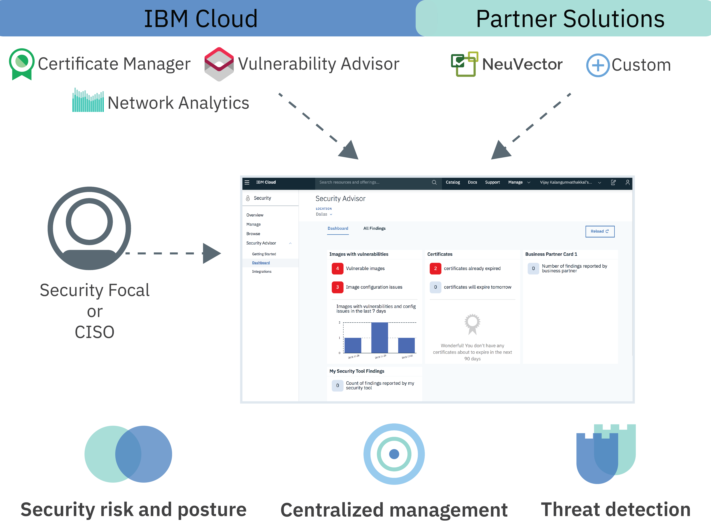

---

copyright:
  years: 2018
lastupdated: "2018-12-04"

---

{:new_window: target="_blank"}
{:shortdesc: .shortdesc}
{:screen: .screen}
{:pre: .pre}
{:table: .aria-labeledby="caption"}
{:codeblock: .codeblock}
{:tip: .tip}
{:download: .download}

# About {{site.data.keyword.security-advisor_short}}
{: #about}

With {{site.data.keyword.security-advisor_long}} security admins can find, prioritize, and manage security issues in their cloud applications and workloads all in one centralized dashboard.
{: shortdesc}

## Service overview
{: #overview}

Before you get started, learn about the service architecture, use cases, and key concepts.

**Is the service for me?**

Security Advisor is most helpful for Security Administrators. That role can take many names. Check out the following table for some example users:

<table>
  <tr>
    <th colspan=2> Security administrators</th>
  </tr>
  <tr>
    <td>CIO</td>
    <td>A CIO or an Enterprise architecture team defines security and compliance policies at a high level for the entire company.</td>
  </tr>
  <tr>
    <td>CISO</td>
    <td>A CISO decides how to implement the policies that are set by the CIO for the systems that are under their control. This could include middleware, servers, or architecture that is deployed. This person would define the security governance and security policies for the organization. They would monitor security risk and define controls to meet compliance standards such as ISO, or GDPR. This person also decides the tools that their teams use.</td>
  </tr>
  <tr>
    <td>Security focal or Dev-Ops professional in charge of security</td>
    <td>This person supports the CISO and executes the needed security checks and investigates any potential risks or issues. </td>
  </tr>
</table>

The described roles might be performed by a single person or multiple people depending on the size of your company. However, the offering was created to address the day-to-day requirements of a CISO or Security focal.

 

## Architecture
{: #architecture}

Security Advisor empowers administrators to manage security through centralized management and visibility by finding security issues and recommending resolutions.
{: shortdesc}

Security Advisor is designed as a micro-service on IBM Cloud. The core micro-service that is provided by the service includes the findings API. The API implements the mechanism for IBM Cloud and partner services to send security findings to your service dashboard, which makes maintaining security on a large scale easier.

The service receives findings from:
* Pre-integrated IBM Cloud services like Certificate Manager and Vulnerability Advisor
* Network Analytics Add-on
* Partners like NeuVector
* Custom integrations with your other security tools

Check out the following image to see the way that Security Advisor components fit together.

<dl>
  <dt>Security risk and posture</dt>
    <dd>Application security is important. Too often announcements are made that announce a new data breach or hack. Security risks will always be a part of development and although attacks can be impossible to plan for, one way to prevent them is to monitor your cloud deployments. For example, the risks can be related to:
    <ul><li>Your container images that are in use.</li>
    <li>Certificates that are expiring that can cause an outage of your cloud service or app.</li>
    <li>Network security issues relating to suspicious clients or servers contacting your IBM Cloud Kubernetes Service deployments.</li></ul></dd>
  <dt>Centralized security management</dt>
    <dd>You can see a consolidated view to of all of your IBM Cloud security services and integrated partner services. You can select and subscribe to different services from the IBM Cloud catalog.</dd>
  <dt>Threat detection</dt>
    <dd>Security Advisor leverages the information that is gathered by IBM X-Force, other IBM Cloud services, and partner solutions to detect risks and threats before they become a security issue. The service also provides analytics on top of vulnerability data and network activity data.</dd>
</dl>

### The Findings API
{: #api}

Out of the box, the service comes with pre-integrated findings that are flagged by the API.
{: shortdesc}

The findings API leverages a Grafeas component for the creation of findings and legato (graphQL) to query your services. You can define Finding metadata and then send findings to the service dashboard through the API for partner tools. The findings are then stored in the findings database that is based on Cloudant.

For every initial finding, a security Security Advisor Instance ID for the account is generated. The service allows 18,000 findings, approximately 200 per day, for each account, in a 90 day period. At the end of the 90 days, the finds are purged. Finding limits are monitored and should the account reach the limit before 90 days, the total findings are reduced to 50% in a FIFO (First in, First Out) model. When the service receives an account delete notification all of the findings related to that account are  purged. You can retrieve all of the findings for your account by using the API and store them yourself for any future use or audit purpose.

 

## Key concepts
{: #concepts}

Learn about different concepts that you might use while working with {{site.data.keyword.security-advisor_short}}.
{: shortdesc}

<dl>
  <dt>Finding</dt>
    <dd>A finding is a priority security issue that is created when raw events are processed. Findings are made up of the key pieces of information that are needed to identify the who, what, when, and where of the issue. As a security admin, you can use {{site.data.keyword.security-advisor_short}} findings to prioritize and react to detected situations.  Findings are few and small in size but contain important insight that requires immediate attention. For example, your server is infected with malware or a certificate is about to expire.</dd>
  <dt>Key Performance Indicator (KPI)</dt>
    <dd>A Key Performance Indicator is triggered when a finding's value is out of bounds from the range of acceptable performance for specific security controls on services and workloads.</dd>
  <dt>Note</dt>
    <dd>A particular type of finding is defined as a note. Grafeas divides the metadata information into notes and occurrences. Notes are high-level descriptions of particular types of metadata. You can create notes to categorize the findings that you come across while you are analyzing. A note can occur multiple times across different providers.</dd>
  <dt>Occurrence</dt>
    <dd>An occurrence is an instantiation of a note that contains provider-specific details. Generally, an occurrence contains the vulnerability details, remediation steps, and other information that might be helpful for resolution.  
    An occurrence describes provider-specific details of a note. The occurrence contains the vulnerability details, remediation steps, and other general information.</dd>
  <dt>Service CRN</dt>
    <dd>The Service CRN identifies the {{site.data.keyword.Bluemix_notm}} service that is involved in the finding. 
    <table>
      <tr>
        <th>Type of finding</th>
        <th>CRN</th>
      </tr>
      <tr>
        <td>{{site.data.keyword.cloudcerts_short}}</td>
        <td>The service instance CRN.</td>
      </tr>
      <tr>
        <td>Network Analytics</td>
        <td>The Kubernetes cluster CRN.</td>
      </tr>
      <tr>
        <td>Vulnerability Advisor</td>
        <td>The container CRN.</td>
      </tr>
    </table></dd>
  <dt>Resource CRN</dt>
    <dd>The resource CRN identifies the specific resource that is involved in the finding.</dd>
</dl>

 

## High-availability and disaster recovery
{: #ha-dr}

{{site.data.keyword.security-advisor_short}} is a highly available, multi-region service.
{: shortdesc}

{{site.data.keyword.security-advisor_short}} is currently supported in both the US-South and UK-South regions. In each supported region, the service runs in several [availability zones](https://www.ibm.com/blogs/bluemix/2018/06/improving-app-availability-multizone-clusters/). {{site.data.keyword.security-advisor_short}} has regional disaster recovery in place. The service maintains a back up database that can be quickly restored within three hours. All of the service data, with the exception of the previous 24 hours, is provided.

 
 
