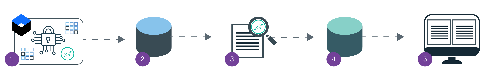

---

copyright:
  years: 2017, 2019
lastupdated: "2019-03-15"

keywords: centralized security, security management, alerts, security risk, insights, threat detection

subcollection: security-advisor

---

{:new_window: target="_blank"}
{:shortdesc: .shortdesc}
{:screen: .screen}
{:pre: .pre}
{:table: .aria-labeledby="caption"}
{:codeblock: .codeblock}
{:tip: .tip}
{:note: .note}
{:important: .important}
{:deprecated: .deprecated}
{:download: .download}

# Network Insights (beta)
{: #network}

With {{site.data.keyword.security-advisor_long}}, you can gain insights based on threat intelligence, behavioral patterns, and machine learning for potentially compromised containers that run on your {{site.data.keyword.containerlong_notm}} clusters.
{: shortdesc}

## How it works
{: #network-how-it-works}

The Network Insights feature is an add-on to the {{site.data.keyword.security-advisor_short}} service. With the feature enabled and configured, cluster network communication, both incoming and outgoing, between your cluster and external entities is collected and continuously monitored and analyzed.

Check out the following image to see the flow of information.

1. As an account administrator, you can install Network Insights into each cluster that you want to monitor.
2. Network flow logs are forwarded to a Cloud Object Storage bucket where they are stored until you decide to delete them. When you use the {{site.data.keyword.security-advisor_short}} GUI to create the bucket, service to service IAM roles are assigned so that the service can view the logs.
3. With Network Insights enabled, the raw data in your COS bucket is analyzed for suspicious behavior.
4. When a possible security issue is flagged, the finding is forwarded to the Findings database.
5. Findings are displayed in your service dashboard on three cards:
  * Suspicious inbound traffic
  * Suspicious outbound traffic
  * Anomalies in traffic

## Collecting data
{: #network-data}

{{site.data.keyword.security-advisor_short}} provides a collector that is used to gather network flow information that takes place between a cluster and external entities.
{: shortdesc}

The raw data that is collected is stored in a Cloud Object Storage bucket where you can determine the length of time that it is stored. You own and control the collected data, which means that you're responsible for storing, securing, and deleting it. {{site.data.keyword.security-advisor_short}} maintains findings for 90 days. During that time, the results are presented on the Network Insights cards in the service dashboard. So, although you will no longer see the finding in your dashboard after 90 days, you might still have the raw data in storage.

The following information is collected:

* The IP address of the peers that are communicating
* The ports that they use
* The set of protocols that are being used
* The amount of data that is transferred
* A set of protocol-specific parameters
* Various time stamps.

**The actual data that is exchanged is not collected.**

From a security point of view, it's a good idea to purge your collected data when legal or company requirements allow for it to be deleted. For more information, check out [Deleting Objects](/docs/services/cloud-object-storage/info?topic=cloud-object-storage-security#deletion).
{: tip}

## Network: Suspicious inbound traffic
{: #network-suspicious-inbound}

{{site.data.keyword.security-advisor_short}} informs you of attempts that are made by external clients to survey and compromise clusters on the **Suspicious Inbound Traffic** card in the service dashboard.
{: shortdesc}

The behavioral patterns of clients that are classified by IBM X-Force as distributing malware that is used as scanners, as part of a botnet, for mining cryptocurrency, or for anonymization services are all continuously monitored. If that type of client approaches your cluster and exhibit  approach a monitored cluster and exhibit an alarming behavior, network insights issues a finding.

The card introduces two Key Risk Indicators (KRIs):

* Reconnaissance by suspicious clients: Includes findings that are related to clients that access the cluster.
* Abnormally large payloads sent by suspicious clients: Includes findings that are related to data volumes that are sent between clients and the cluster. An abnormal payload is anything that is out of character for your cluster.

Findings might include suspicious clients that:

* Send abnormally large amounts of data into the cluster.
* Perform an abnormally large number of requests to a cluster service.
* Appear to target the cluster as exhibited by the number of attempts that it performs to survey the cluster.

## Network: Suspicious outbound traffic
{: #network-suspicious-outbound}

{{site.data.keyword.security-advisor_short}} informs you of any potentially compromised containers that run on your {{site.data.keyword.containershort_notm}} clusters in the **Suspicious Outbound Traffic** card in the service dashboard.
{: shortdesc}

The service continuously monitors the behavioral patterns of containers that access clients that are classified by IBM X-Force as distributing malware that is used as scanners, as part of a botnet, for mining cryptocurrency, or for anonymization services. After a container on a monitored cluster approaches the suspicious peers and exhibits alarming behavior, network insights issues a finding.

The card introduces two Key Risk Indicators (KRIs):

* Outbound approaches to suspicious servers: Findings that are related to a cluster that access the servers.
* Abnormally large payloads exchanged with suspicious servers: Findings that are related to data volumes that are sent between the cluster and servers.

Findings might include containers that:

* Send abnormally large amounts of data to a suspicious server.
* Extract a large amount of data from a suspicious server.
* Perform a large number of requests to a suspicious server.

## Network: Anomalies in traffic (experimental)
{: #network-anomalies}

In this experimental feature, {{site.data.keyword.security-advisor_short}} monitors your network to learn behavioral patterns. After patterns are formed, any behavior that appears to be abnormal is flagged and summarized in the service dashboard in the **Anomalies in traffic** card.
{: shortdesc}

A model of normal container behavior is created by monitoring the behavioral patterns between a container and its peers. When the model is captured, it is monitored for specific changes. If an alarming change is exhibited, then Network Insights issues a finding.

The card introduces two Key Risk Indicators (KRIs):

* Higher than normal reconnaissance or data exchange activity: Findings that are related to abnormal interactions that are detected between the cluster and any external peers.
* Outbound approach to a new server: Findings that are related to new detected servers that the cluster approaches.

A finding might include:  

* Containers that approach servers that were never approached previously.
* Containers that send out or consume significantly more data than normal to or from specific peers.
* The level of surveying of a particular increased significantly.

 After the model is developed, deviations from the learned model are detected, and when an alarming change is exhibited, Network Insights posts a finding to the Security Advisor dashboard. Findings are summarized in the 'Network: Anomalies in Traffic' card. The card introduces two Key Risk Indicators (KRIs). The 'Higher than normal reconnaissance or data exchange activity' KRI counts findings that are related to abnormal interactions detected between the cluster and external peers. The 'Outbound approach to a new server' KRI counts findings that are related to new detected servers approaches by the cluster.  

## Next steps
{: #network-next}

Ready to get started? Check out [Enabling Network Insights](/docs/services/security-advisor?topic=security-advisor-setup-network#setup-network)!
