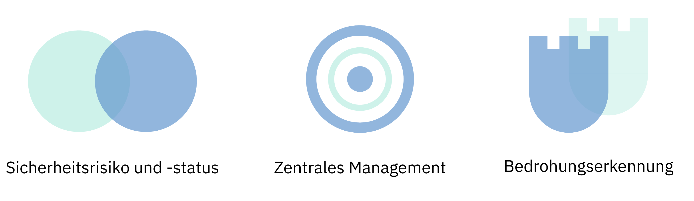
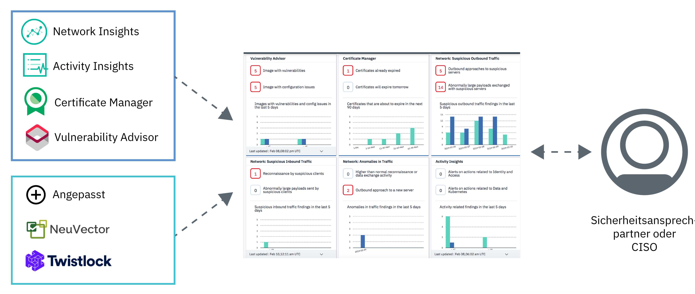

---

copyright:
  years: 2017, 2019
lastupdated: "2019-03-07"

keywords: centralized security, security management, alerts, security risk, insights, threat detection

subcollection: security-advisor

---

{:new_window: target="_blank"}
{:shortdesc: .shortdesc}
{:screen: .screen}
{:pre: .pre}
{:table: .aria-labeledby="caption"}
{:codeblock: .codeblock}
{:tip: .tip}
{:note: .note}
{:important: .important}
{:deprecated: .deprecated}
{:download: .download}

# Informationen zu {{site.data.keyword.security-advisor_short}}
{: #about}

Mithilfe eines einheitlichen Dashboards, das Sicherheitsadministratoren über Probleme benachrichtigt und sie beim Erkennen, Priorisieren, Verwalten und Lösen von Sicherheitsproblemen bei ihren Cloudanwendungen und Workloads anleitet, ermöglicht {{site.data.keyword.security-advisor_long}} ein zentrales Sicherheitsmanagement.
{: shortdesc}

## Vorteile der Verwendung des Service
{: #about-benefits}

<dl>
  <dt>Sicherheitsrisiko und -status</dt>
    <dd>Anwendungssicherheit ist angesichts der ständig erscheinenden Nachrichtenartikel zu Datenschutzverletzungen oder Hackerattacken weiterhin wichtig. Sicherheitsrisiken werden stets Teil der Entwicklung sein; doch obwohl Hackerattacken schwer vorauszusagen sind, können Sie durch eine engmaschige Überwachung Ihrer Cloudbereitstellungen verhindert werden. Die Risiken können sich beispielsweise beziehen auf Sicherheitslücken in den von Ihnen verwendeten Container-Images, auf abgelaufene Zertifikate, die zu Ausfällen Ihres Cloud-Services oder Ihrer Cloudanwendung führen, oder darauf, dass verdächtige Clients oder Server mit bekannt schlechter Reputation mit Ihren Clustern interagieren.</dd>
  <dt>Zentrales Sicherheitsmanagement</dt>
    <dd>Sie können eine konsolidierte Ansicht aller Ihrer {{site.data.keyword.cloud_notm}}-Sicherheitsservices und der integrierten Partnerservices anzeigen. Im {{site.data.keyword.cloud_notm}}-Katalog können Sie verschiedene Services auswählen und abonnieren.</dd>
  <dt>Bedrohungserkennung</dt>
    <dd>{{site.data.keyword.security-advisor_short}} nutzt die von IBM X-Force, von anderen {{site.data.keyword.cloud_notm}}-Services und von Partnerlösungen erfassten Informationen, um Risiken und Bedrohungen zu erkennen, bevor sie zu einem Sicherheitsproblem werden. Darüber hinaus stellt der Service außer Netzaktivitätsdaten und Daten zu Sicherheitslücken auch Analysen bereit.</dd>
</dl>

## Funktionsweise
{: #how-it-works}

Damit das Gewährleisten der Sicherheit in großem Maßstab möglich ist, wurde {{site.data.keyword.security-advisor_short}} als Mikroservice in {{site.data.keyword.cloud_notm}} konzipiert. Als zentraler Mikroservice wird die API für Untersuchungsergebnisse bereitgestellt, die das Verfahren, mit dem Untersuchungsergebnisse zur Sicherheit an Ihr Service-Dashboard gesendet werden, für {{site.data.keyword.cloud_notm}} und Partnerservices implementiert.
{: shortdesc}

Der Service erhält von folgenden Elementen Untersuchungsergebnisse:
* Vorintegrierten {{site.data.keyword.cloud_notm}}-Services wie beispielsweise Certificate Manager und Vulnerability Advisor
* Network Insights
* Activity Insights
* Partnern wie NeuVector und Twistlock
* Angepassten Integrationen, die Ihre übrigen Sicherheitstools umfassen

Anhand der folgenden Abbildung können Sie erkennen, wie die einzelnen {{site.data.keyword.security-advisor_short}}-Komponenten zusammengehören.

{{site.data.keyword.security-advisor_short}} ist für Sicherheitsadministratoren besonders hilfreich. Diese Rolle kann unterschiedliche Bezeichnungen tragen. In der folgenden Tabelle finden Sie einige Beispielbenutzer:

<table>
  <tr>
    <th colspan=2> Sicherheitsadministratoren</th>
  </tr>
  <tr>
    <td>IT-Verantwortlicher</td>
    <td>Ein IT-Verantwortlicher oder ein Team, das für die Unternehmensarchitektur zuständig ist, definiert übergeordnete Sicherheits- und Konformitätsrichtlinien, die für das gesamte Unternehmen gelten.</td>
  </tr>
  <tr>
    <td>CISO</td>
    <td>Ein CISO (Chief Information Security Officer) entscheidet, wie die von den IT-Verantwortlichen festgelegten Richtlinien für die unter ihrer Kontrolle stehenden Systeme implementiert werden. Dazu können Middleware, Server oder bereitgestellte Architektur gehören. Die Aufgabe dieser Person ist es, die für Sicherheit geltende Governance und die Sicherheitsrichtlinien für die Organisation zu definieren. Sie überwacht das Sicherheitsrisiko und definiert Kontrollmechanismen, mit denen für die Einhaltung von Konformitätsstandards wie ISO oder DSGVO gesorgt wird. Diese Person entscheidet auch über die Tools, die von ihren Teams verwendet werden.</td>
  </tr>
  <tr>
    <td>Sicherheitsansprechpartner</td>
    <td>Diese Person unterstützt den CISO und führt die erforderlichen Sicherheitsprüfungen aus und untersucht mögliche Risiken oder Probleme. </td>
  </tr>
</table>

Die beschriebenen Rollen können abhängig von der Größe Ihres Unternehmens von einer einzigen Person oder mehreren Personen ausgeführt werden. Das Angebot wurde jedoch erstellt, um den täglichen Anforderungen eines CISO oder eines Sicherheitsansprechpartners zu begegnen.

### Die API für Untersuchungsergebnisse
{: #api}

Der Service wird ohne Vorbereitungs- oder Anpassungsaufwand mit vorintegrierten Untersuchungsergebnissen geliefert, die von der API markiert sind.
{: shortdesc}

Die API für Untersuchungsergebnisse in {{site.data.keyword.security-advisor_short}} richtet sich beim Speichern, Abfragen und Abrufen von kritischen Metadaten nach der API-Spezifikation <a href="http://grafeas.ng.bluemix.net/ui/" target="_blank">Grafeas </a> für Artefaktmetadaten. Die Untersuchungsergebnisse werden von Sicherheitsdiensten und -tools gemeldet.

{{site.data.keyword.security-advisor_short}} ist standardmäßig für alle {{site.data.keyword.cloud_notm}}-Konten aktiviert. Daher müssen Sie keine Instanz des Service bereitstellen. Eine Instanz von {{site.data.keyword.security-advisor_short}} wird entweder beim erstmaligen Zugriff auf das Dashboard oder beim Melden des ersten Untersuchungsergebnisses automatisch erstellt. Der Service lässt in einem Zeitraum von 90 Tagen pro Konto 18.000 Untersuchungsergebnisse zu, d. h. ca. 200 pro Tag. Am Ende der 90 Tage werden die Untersuchungsergebnisse gelöscht. Die Grenzwerte für die Anzahl der Untersuchungsergebnisse werden überwacht; sollte das Konto vor Ablauf der 90 Tage den Grenzwert erreichen, wird die Gesamtzahl der Untersuchungsergebnisse innerhalb eines FIFO-Modells (First in, First out – die ältesten Ergebnisse werden zuerst gelöscht) auf 50 Prozent reduziert. Wenn der Service die Benachrichtigung zum Löschen des Kontos empfängt, werden alle auf dieses Konto bezogenen Untersuchungsergebnisse gelöscht. Sie können alle auf Ihr Konto bezogenen Untersuchungsergebnisse mithilfe der API abrufen und sie für eine zukünftige Verwendung oder für Prüfzwecke selbst speichern.

## Wichtige Begriffe
{: #concepts}

Hier finden Sie Informationen zu verschiedenen Begriffen, die bei der Arbeit mit {{site.data.keyword.security-advisor_short}} auftauchen können.
{: shortdesc}

<dl>
  <dt>Untersuchungsergebnis</dt>
    <dd>Ein Untersuchungsergebnis ist ein prioritätsbezogenes Sicherheitsproblem, das bei der Verarbeitung von unformatierten Ereignissen erstellt wird. Untersuchungsergebnisse bestehen aus den einzelnen Schlüsselinformationen, die erforderlich sind, um die Frage nach dem Wer, Was, Wann und Wo des Problems zu beantworten. Als Sicherheitsadministrator können Sie mithilfe von {{site.data.keyword.security-advisor_short}}-Untersuchungsergebnissen erkannte Situationen priorisieren und darauf reagieren.  Die Anzahl und der Umfang der Untersuchungsergebnisse sind gering, aber sie enthalten wichtige Einblicke, die sofort berücksichtigt werden müssen. Ihr Server kann beispielsweise mit Malware infiziert sein oder ein Zertifikat läuft bald ab.</dd>
  <dt>Key Risk Indicator (KRI)</dt>
    <dd>Der Key Risk Indicator (KRI) ist eine Kennzahl, die für den Sicherheitsansprechpartner das Risiko von Untersuchungsergebnissen angibt. KRIs signalisieren dem Sicherheitsansprechpartner in einem frühen Stadium ansteigende Risikopotenziale in verschiedenen Bereichen der Cloudressourcen eines Unternehmens. Ein KRI wird ausgelöst, wenn der Wert eines Untersuchungsergebnisses bei bestimmten Sicherheitsmaßnahmen für Services und Workloads außerhalb des vertretbaren Leistungsbereichs liegt.</dd>
  <dt>Anmerkung</dt>
    <dd>Ein bestimmter Typ von Untersuchungsergebnis ist als 'Anmerkung' (note) definiert. Grafeas unterteilt die Metadateninformationen in 'Anmerkungen' und 'Vorkommen' (occurrence). 'Anmerkungen' sind übergeordnete Beschreibungen bestimmter Metadatentypen. Sie können für die einzelnen Untersuchungsergebnistypen, die von unterschiedlichen Providern bereitgestellt werden, unterschiedliche Anmerkungen erstellen.</dd>
  <dt>Vorkommen</dt>
    <dd>In einem Vorkommen werden providerspezifische Details einer Anmerkung beschrieben. Das Vorkommen enthält die Details zur Sicherheitslücke, die Korrekturschritte und andere allgemeine Informationen.</dd>
  <dt>Karte</dt>
    <dd>Metadaten, die zum Darstellen der Untersuchungsergebnisse im Service-Dashboard verwendet werden, sind durch eine Anmerkung des Typs 'Karte' (<code>CARD</code>) definiert. {{site.data.keyword.security-advisor_short}} unterstützt für eine Karte (<code>CARD</code>) drei Typen von KRI-Elementen: <ul><li>Numerisch</li><li>Aufgliederung</li><li>Zeitreihen</li></ul></dd>
  <dt>Provider</dt>
    <dd>Ein Provider ist das Tool oder der Service, der den Untersuchungsergebnistyp (Anmerkung) definiert und anschließend ein Vorkommen des Untersuchungsergebnisses an den Service sendet.</dd>
  <dt>Service-CRN</dt>
    <dd>Der Service-CRN gibt den {{site.data.keyword.Bluemix_notm}}-Service an, der an dem Untersuchungsergebnis beteiligt ist. Die ID der Serviceinstanz oder die CRN der Serviceinstanz von Certificate Manager, die die Untersuchungsergebnisse gemeldet hat, wird beispielsweise in ein Untersuchungsergebnis über den Ablauf eines Zertifikats eingeschlossen.</dd>
  <dt>Ressourcen-CRN</dt>
    <dd>Der Ressourcen-CRN gibt die Ressource an, die an dem Untersuchungsergebnis beteiligt ist. Wenn Network Analytics ein Untersuchungsergebnis berichtet, muss die CRN des Kubernetes-Clusters eingeschlossen werden, um den betroffenen Cluster oder die betroffene Ressource zu identifizieren.</dd>
</dl>

## Hochverfügbarkeit und Disaster-Recovery
{: #ha-dr}

{{site.data.keyword.security-advisor_short}} ist ein hoch verfügbarer Service für mehrere Regionen.
{: shortdesc}

{{site.data.keyword.security-advisor_short}} wird zurzeit sowohl in der Region Dallas als auch in der Region London unterstützt. In jeder unterstützten Region wird der Service in mehreren <a href="https://www.ibm.com/blogs/bluemix/2018/06/improving-app-availability-multizone-clusters/" target="_blank">Verfügbarkeitszonen </a> ausgeführt. {{site.data.keyword.security-advisor_short}} verfügt über eine regionale Disaster-Recovery. Der Service verwaltet eine Backup-Datenbank, die schnell innerhalb von drei Stunden wiederhergestellt werden kann. Mit Ausnahme der letzten 24 Stunden werden sämtliche Servicedaten bereitgestellt.
