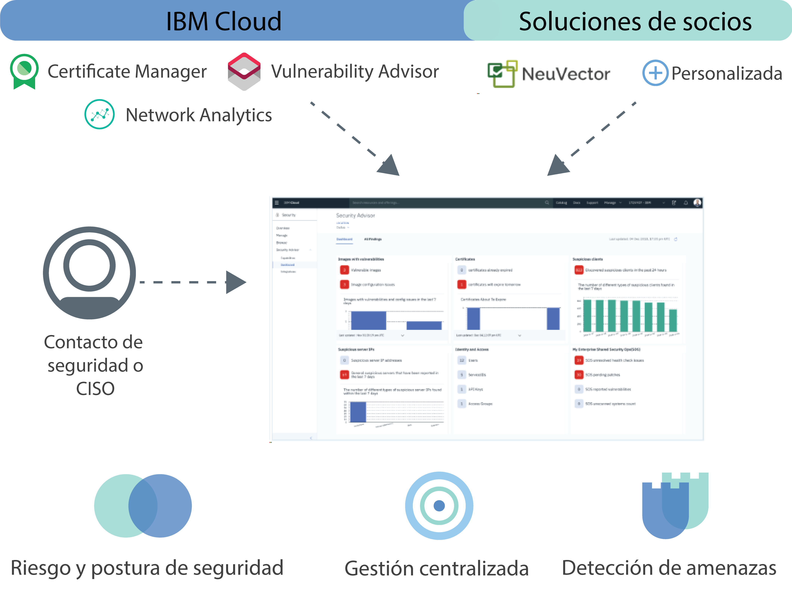

---

copyright:
  years: 2018
lastupdated: "2018-12-09"

---

{:new_window: target="_blank"}
{:shortdesc: .shortdesc}
{:screen: .screen}
{:pre: .pre}
{:table: .aria-labeledby="caption"}
{:codeblock: .codeblock}
{:tip: .tip}
{:download: .download}

# Acerca de {{site.data.keyword.security-advisor_short}}
{: #about}

{{site.data.keyword.security-advisor_long}} permite la gestión de la seguridad centralizada a través de un panel de control unificado que alerta de los problemas a los administradores de seguridad y los guía para comprender, priorizar, gestionar y resolver problemas de seguridad relacionados con sus cargas de trabajo y aplicaciones de la nube.
{: shortdesc}

## Visión general del servicio
{: #overview}

Antes de empezar, obtenga información sobre la arquitectura del servicio, los casos de uso y los conceptos clave.

**¿Es el servicio para mí?**

Security Advisor es más útil para los administradores de seguridad. Este rol puede tener muchos nombres. Consulte la tabla siguiente para ver algunos usuarios de ejemplo:

<table>
  <tr>
    <th colspan=2> Administradores de seguridad</th>
  </tr>
  <tr>
    <td>CIO</td>
    <td>Un CIO o equipo de arquitectura de empresa define las políticas de seguridad y conformidad a un nivel alto para toda la empresa.</td>
  </tr>
  <tr>
    <td>CISO</td>
    <td>Un CISO decide cómo implementar las políticas que establece el CIO para los sistemas que están bajo su control. Estos pueden incluir middleware, servidores o arquitectura que esté desplegada. Esta persona define las políticas de seguridad y de gobierno de seguridad de la organización. Supervisa el riesgo de seguridad y define los controles para cumplir los estándares de conformidad como, por ejemplo, ISO o GDPR. Esta persona también decide las herramientas que utilizan sus equipos.</td>
  </tr>
  <tr>
    <td>Contacto de seguridad</td>
    <td>Esta persona da soporte al CISO y ejecuta los controles de seguridad necesarios e investiga los riesgos o problemas potenciales. </td>
  </tr>
</table>

Los roles descritos pueden ser realizados por una sola persona o por varias personas en función del tamaño de la empresa. Sin embargo, la oferta se ha creado para satisfacer los requisitos del día a día de un CISO o un contacto de seguridad.

 

## Arquitectura
{: #architecture}

Para mantener la seguridad a gran escala, Security Advisor está diseñado como un micro-servicio en IBM Cloud. El microservicio principal que se proporciona es la API de hallazgos que implementa el mecanismo para que IBM Cloud y los servicios asociados envíen los resultados de seguridad al panel de control del servicio.
{: shortdesc}

El servicio recibe resultados de:
* Servicios de IBM Cloud preintegrados como Certificate Manager y Vulnerability Advisor
* Complemento Network Analytics
* Asociados como NeuVector
* Integraciones personalizadas con sus otras herramientas de seguridad

Consulte la imagen siguiente para ver la forma en la que los componentes de Security Advisor encajan entre sí.

<dl>
  <dt>Riesgo y postura de seguridad</dt>
    <dd>La seguridad las aplicaciones sigue siendo importante, con artículos de noticias constantes que anuncian una nueva infracción de datos o hackeo. Los riesgos de seguridad siempre formarán parte del desarrollo y, aunque los ataques son difíciles de predecir, un modo de evitarlos es supervisar estrechamente los despliegues de nube. Por ejemplo, los riesgos pueden estar relacionados con las vulnerabilidades de las imágenes de contenedor que estén en uso, los certificados de caducidad que puedan provocar la interrupción del servicio o aplicación en la nube o los clientes o servidores sospechosos con una mala reputación conocida que interactúen con los clústeres.</dd>
  <dt>Gestión de la seguridad centralizada</dt>
    <dd>Puede ver una vista consolidada de todos sus servicios de seguridad de IBM Cloud y servicios de seguridad integrados de IBM Cloud. Puede seleccionar y suscribirse a distintos servicios desde el catálogo de IBM Cloud.</dd>
  <dt>Detección de amenazas</dt>
    <dd>Security Advisor aprovecha la información recopilada por IBM X-Force, otros servicios de IBM Cloud y soluciones de socios para detectar riesgos y amenazas antes de que se conviertan en un problema de seguridad. El servicio también proporciona análisis además de datos de actividad de red y datos de vulnerabilidad.</dd>
</dl>

### API de hallazgos
{: #api}

De forma predeterminado, el servicio se suministra con hallazgos preintegrados que están marcados por la API.
{: shortdesc}

La API de hallazgos de Security Advisor sigue la especificación de la API de metadatos de artefacto [Grafeas](http://grafeas.ng.bluemix.net/ui/) para almacenar, consultar y recuperar metadatos críticos. Los servicios y herramientas de seguridad notifican los hallazgos.

El Asesor de seguridad está habilitado de forma predeterminada para todas las cuentas de IBM Cloud. Como tal, no es necesario que suministre ninguna instancia del servicio. Una instancia de Security Advisor se crea automáticamente en el acceso inicial del panel de instrumentos o bien cuando se informa de un resultado inicial. El servicio permite obtener 18.000 hallazgos, aproximadamente 200 por día, para cada cuenta, en un período de 90 días. Después de los 90 días, se depuran los hallazgos. Los límites de los hallazgos se supervisan y si la cuenta alcanza el límite antes de 90 días, el total de resultados se reduce al 50% según un modelo FIFO (Primero en entrar, primero en salir). Cuando el servicio recibe una notificación de supresión de cuenta, se depuran todos los hallazgos relacionados con dicha cuenta. Puede recuperar todos los hallazgos para su cuenta utilizando la API y almacenarlos usted mismo para utilizarlos en el futuro o para fines de auditoría.

 

## Conceptos clave
{: #concepts}

Obtenga más información sobre los distintos conceptos que puede utilizar cuando trabaje con {{site.data.keyword.security-advisor_short}}.
{: shortdesc}

<dl>
  <dt>Hallazgo</dt>
    <dd>Un hallazgo es un problema de seguridad de prioridades que se crea cuando se procesan sucesos en bruto. Los hallazgos están hechos de las partes clave de la información que se necesitan para identificar quién, qué, cuándo y dónde en relación con el problema. Como administrador de seguridad, puede utilizar los hallazgos de {{site.data.keyword.security-advisor_short}} para priorizar y reaccionar ante situaciones detectadas.  Los hallazgos son pocos y pequeños en tamaño, pero contienen una perspectiva importante que requiere una atención inmediata. Por ejemplo, el servidor está infectado con un malware o un certificado está a punto de caducar.</dd>
  <dt>Indicador clave de riesgo (KRI)</dt>
    <dd>El indicador clave de riesgo (KRI) es una medida utilizada para indicar el riesgo de los hallazgos para el contacto de seguridad. Los KRI proporcionan una señal temprana de exposiciones de riesgo en aumento en varias áreas de los recursos de la nube de la empresa para el contacto de seguridad. Un KRI se desencadena cuando el valor de un hallazgo está fuera de los límites del rango de rendimiento aceptable para controles de seguridad específicos en servicios y cargas de trabajo.</dd>
  <dt>Nota</dt>
    <dd>Un determinado tipo de hallazgo se define como una nota. Grafeas divide la información de metadatos en notas y apariciones. Las notas son descripciones de alto nivel de determinados tipos de metadatos. Puede crear notas diferentes para cada tipo de hallazgo enviado por distintos proveedores.</dd>
  <dt>Aparición</dt>
    <dd>Una aparición describe los detalles específicos del proveedor de una nota. La aparición contiene los detalles de la vulnerabilidad, los pasos para solucionarla y otra información general.</dd>
  <dt>Tarjeta</dt>
    <dd>Los metadatos que se utilizan para visualizar los hallazgos en el panel de control del servicio se definen mediante el tipo de nota <code>CARD</code>. Security Advisor soporta tres tipos de elementos de KRI para una <code>CARD</code>: <ul><li>Numérico</li><li>Desglose</li><li>Serie temporal</li></ul></dd>
  <dt>Proveedor</dt>
    <dd>Un proveedor es la herramienta o servicio que define el tipo de hallazgo (nota) y, a continuación, envía una aparición del hallazgo al servicio.</dd>
  <dt>CRN de servicio</dt>
    <dd>El CRN de servicio identifica el servicio de {{site.data.keyword.Bluemix_notm}} involucrado en el hallazgo. Por ejemplo, en un hallazgo de caducidad de certificado, se incluirá el CRN o ID de instancia de servicio de la instancia de servicio de Certificate Manager que informa de los resultados.</dd>
  <dt>CRN de recurso</dt>
    <dd>El CRN del recurso identifica el recurso específico que está involucrado en el resultado. Cuando la analítica de red informa de un hallazgo, se incluye el CRN de clúster de Kubernetes para identificar el clúster o el recurso afectado.</dd>
</dl>

 

## Alta disponibilidad y recuperación en caso de error
{: #ha-dr}

{{site.data.keyword.security-advisor_short}} es un servicio de varias regiones de alta disponibilidad.
{: shortdesc}

{{site.data.keyword.security-advisor_short}} está soportado actualmente en las regiones de Dallas y Londres. En cada región soportada, el servicio se ejecuta en varias [zonas de disponibilidad](https://www.ibm.com/blogs/bluemix/2018/06/improving-app-availability-multizone-clusters/). {{site.data.keyword.security-advisor_short}} dispone de recuperación en caso de error regional. El servicio mantiene una base de datos de copia de seguridad que se puede restaurar rápidamente en tres horas. Se proporcionan todos los datos de servicio, con la excepción de las 24 horas anteriores.

 
 
