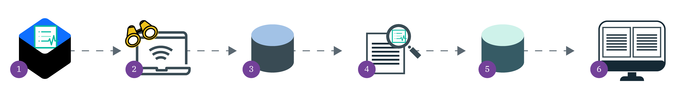

---

copyright:
  years: 2017, 2019
lastupdated: "2019-03-14"

keywords: centralized security, security management, alerts, security risk, insights, threat detection

subcollection: security-advisor

---

{:new_window: target="_blank"}
{:shortdesc: .shortdesc}
{:screen: .screen}
{:pre: .pre}
{:table: .aria-labeledby="caption"}
{:codeblock: .codeblock}
{:tip: .tip}
{:note: .note}
{:important: .important}
{:deprecated: .deprecated}
{:download: .download}

# Activity Insights (presentación)
{: #activity}

Con {{site.data.keyword.security-advisor_long}}, puede detectar actividad sospechosa de usuarios en su cuenta de {{site.data.keyword.Bluemix_notm}} mediante {{site.data.keyword.cloud_notm}} Activity Tracker.
{: shortdesc}


## Funcionamiento
{: #activity-how}

La característica Activity Insights es un complemento del servicio {{site.data.keyword.security-advisor_short}}. Con la característica habilitada y configurada, el comportamiento del usuario se registra y se analiza para identificar actividades sospechosas en función de reglas. Puede utilizar reglas predeterminadas o puede crear reglas personalizadas que se ajusten a su organización.

Consulte la imagen siguiente para ver el flujo de información.



1. Como administrador de la cuenta, puede instalar Activity Insights en el clúster.
2. Con el complemento instalado en un clúster, puede supervisar registros de Activity Tracker para toda la cuenta.
3. Los registros de actividad se reenvían a un grupo de Cloud Object Storage (COS), donde se almacenan hasta que decide suprimirlos. Si utiliza la GUI de {{site.data.keyword.security-advisor_short}} para crear el grupo, se asignan roles de IAM de servicio a servicio para que el servicio pueda ver los registros.
4. Con la característica Activity habilitada, los datos sin procesar del grupo de COS se analizan en función de reglas que puede haber predefinido el servicio o que puede haber personalizado el usuario.
5. Cuando se detecta un posible problema de seguridad, el hallazgo se reenvía a la base de datos de hallazgos.
6. Los hallazgos se muestran en el panel de control de servicio en la tarjeta de **Activity Insights**.

</br>

## Recopilación de datos
{: #activity-data}

Activity Tracker recopila sucesos que describen las interacciones de los usuarios con las API de {{site.data.keyword.cloud_notm}}. A continuación, puede almacenar los registros en un grupo de Object Storage para realizar un análisis más detallado.
{: shortdesc}

Activity Tracker recopila sucesos que describen las interacciones de los usuarios con las API de {{site.data.keyword.cloud_notm}}.

La información recopilada incluye:

* La dirección IP del iniciador de la llamada de API
* El usuario que se ha autenticado
* El tipo de actividad
* El resultado de la actividad
* Y más...

Los datos sin procesar que se recopilan se almacenan en un grupo de Cloud Object Storage, donde puede determinar el intervalo de tiempo durante el cual se almacenan. El usuario es el propietario de los datos recopilados y los controla, lo que significa que es el responsable de almacenarlos, protegerlos y suprimirlos. {{site.data.keyword.security-advisor_short}} mantiene los hallazgos durante 90 días. Durante ese tiempo, los resultados se presentan en la tarjeta de **Activity Insights** en el panel de control de servicio. Por lo tanto, aunque ya no verá el hallazgo en el panel de control transcurridos 90 días, es posible que todavía tenga los datos sin procesar en el almacenamiento.

Desde un punto de vista de seguridad, suele resultar recomendable eliminar los datos recopilados cuando los requisitos legales o de la empresa permitan que se supriman. Para obtener más información, consulte [Supresión de objetos](/docs/services/cloud-object-storage/info?topic=cloud-object-storage-security#deletion).
{: tip}

## Activity Insights: Acceso
{: #ai-access}

La tarjeta de Activity Insights del panel de control del servicio resume cualquier indicación de actividad de cuenta inesperada o alarmante por parte de usuarios y servicios. Las actividades que se salen de lo normal pueden deberse a un comportamiento inesperado por parte de usuarios y servicios legítimos o pueden indicar que la cuenta está en peligro. Los hallazgos que se ven en la tarjeta se determinan en función de los paquetes de reglas predeterminados que proporciona {{site.data.keyword.security-advisor_short}}.

La tarjeta incorpora dos indicadores de riesgo clave (KRI):

* Identity and Access: los hallazgos relacionados con los servicios Identity and Access Management (IAM) o App ID.
* Datos y Kubernetes: los hallazgos relacionados con Key Protect, el servicio Kubernetes, Cloud Object Storage o Certificate Manager.


## Visión general de los paquetes de reglas
{: #activity-packages}

Como administrador de la cuenta, puede empezar a supervisar rápidamente sus cuentas aprovechando los paquetes de reglas.
{: shortdesc}

El servicio ofrece paquetes de reglas que están asociados a varios servicios, que incluyen:

* {{site.data.keyword.containerlong_notm}}
* {{site.data.keyword.Bluemix_notm}} Identity and Access Management (IAM)
* {{site.data.keyword.cloudcerts_long_notm}}
* {{site.data.keyword.appid_long_notm}}
* {{site.data.keyword.keymanagementservicelong_notm}}
* {{site.data.keyword.cos_full_notm}} (COS)

Si los paquetes actuales no satisfacen todas sus necesidades, siempre puede actualizar un paquete existente o crear uno nuevo para adaptar las reglas a su organización.

### ¿Qué es una regla?
{: #ai-rule}

Una regla es la combinación de condiciones y un solo suceso. Puede utilizar reglas, o una combinación de reglas, para desencadenar hallazgos que se pueden visualizar en el panel de control de {{site.data.keyword.security-advisor_short}}.

Ejemplo:

```
	{
		"comment": "Dormant Rule: Very high risk App ID activity... ",
		"dormant": true,
		"conditions": { 	… },
		"event": { … }
		"type": "aggregate"
	}
```
{: screen}

Además de una condición y de un suceso, las reglas también pueden contener los campos que se encuentran en la tabla siguiente.

<table>
	<tr>
		<th colspan=2> Visión general de los componentes de una regla</th>
	</tr>
	<tr>
		<td><code>comment</code></td>
		<td>Siempre se pasa por alto.</td>
	</tr>
	<tr>
		<td><code>dormant</code></td>
		<td>Un cambo booleano que se pasa por alto si tiene el valor true. Si el valor tiene el valor false o indefinido, la regla se utiliza.</td>
	</tr>
	<tr>
		<td><code>type</code></td>
		<td>Las opciones incluyen: <code>aggregate</code>, <code>coincident</code> y <code>boolean</code>. Si el tipo no tiene asignado el valor <code>aggregate</code> o <code>coincident</code>, se evalúa como <code>boolean</code>.</td>
	</tr>
</table>

</br>

### ¿Qué es una condición?
{: #ai-condition}

Una condición básica es un bloque de creación que consta de tres componentes. Los bloques se enlazan mediante los operadores `any` y `all`
y se pueden anidar. Un operador `all` equivale a `y`, mientras que `any` equivale a `o`.

Ejemplo:

```
	"conditions": {
		"all": [{
			"any": [{
				"fact": "action",
				"operator": "equal",
				"value": "iam-groups.group.delete"
			},
			{
				"fact": "action",
				"operator": "equal",
				"value": "iam-groups.member.delete"
			}]
		}
	}
```
{: screen}

<table>
	<tr>
		<th colspan=2> Visión general de los componentes de una condición</th>
	</tr>
	<tr>
		<td><code>fact</code></td>
		<td>El suceso CADF de Activity Tracker que se está investigando.</td>
	</tr>
	<tr>
		<td><code>operator</code></td>
		<td>Las opciones incluyen: <code>equal</code>, <code>notEqual</code>, <code>lessThan</code>, <code>greaterThan</code>, <code>in</code> y <code>notIn</code></td>
	</tr>
	<tr>
		<td><code>value</code></td>
		<td>El modo en que está definida una acción. El valor generalmente corresponde a una llamada de API que se puede utilizar para interactuar con el servicio.</td>
	</tr>
</table>

</br>

### ¿Qué es un suceso?
{: #ai-event}

Un suceso se compone de dos campos: `type` y `params.findingType`. El primero es un identificador exclusivo de una regla y `params.findingType` es el nombre del hallazgo que se emite al servicio. El nombre del hallazgo permite mostrarlo en el panel de control de {{site.data.keyword.security-advisor_short}}.

Ejemplo:

```
	{
		"conditions": { 	… },
		"event": {
			"type": "IKS high risk API",
			"params": {"findingType": "IKS-high-risk"}
		}
	}
```
{: screen}


### Tipo de regla: aggregate
{: #rule-aggregate}

El tipo de regla aggregate cuenta el número de veces que aparece una acción en un intervalo de tiempo específico y desencadena un hallazgo si se supera el umbral definido. La regla se define añadiendo el umbral y la ventana de tiempo a la condición booleana. Se deben cumplir varias condiciones para que se defina la regla.

* El tipo de regla debe ser `aggregate`.
* La condición raíz debe contener los siguientes hechos:

	```
	{
			"fact": "occurrences",
			"operator": [equal | greaterThan | greaterThanInclusive],
			"value": [positive number]
	},
	{
	    "fact": "withInLast",
	    "operator": "equal",
	    "value": "X [minutes|hours]",
	}
	```
	{: screen}

	Algunas aclaraciones:
	* X = un entero positivo distinto de cero
	* Si se seleccionan horas, el valor máximo es 24
	* Si se seleccionan minutos, el valor máximo es 1440

**ejemplo**

En el siguiente ejemplo se muestra una regla que cuenta cinco intentos fallidos en un periodo de 30 minutos:

```
{
    "conditions": {
        "all": [
            {
                "fact": "action",
                "operator": "equal",
                "value": "iam-identity.user-apikey.login"
            },
            {
                "fact": "reason",
                "operator": "equal",
                "value": 400,
                "path": ".reasonCode"
            },
            {
                "fact": "occurrences",
                "operator": "equal",
                "value": 5
            },
            {
                "fact": "withInLast",
                "operator": "equal",
                "value": "30 minutes",
            }
        ]
    },
    "event": {
        "type": "failed-login-attempts",
        "params": {
            "findingType": "failed-login-attempts",
        }
    },
    "type" : "aggregate"
}
```
{: screen}

### Tipo de regla: coincident
{: #rule-coincident}

El tipo de regla coincident supervisa las acciones para ver el número de veces que se produce la misma acción en una ventana de tiempo. La regla se define añadiendo una ventana de tiempo a un grupo de bloques de creación de condición básica. El orden en el que se producen las acciones no importa en la regla coincidente, pero se deben cumplir varias condiciones para que se defina la regla.

* El tipo de regla debe ser `coincident`.
* La condición raíz debe ser de la variedad `all`.
* La condición raíz debe contener los siguientes hechos:

	```
	{
	    "fact": "actions",
	    "operator": "contains",
	    "value": [action value]
	},
	{
	    "fact": "withInLast",
	    "operator": "equal",
	    "value": "X [minutes|hours]",
	}
	```
	{: screen}

	Algunas aclaraciones:
	* El valor `fact` debe ser plural: `actions`, no `action`.
	* X = un entero positivo distinto de cero
	* Si se seleccionan horas, el valor máximo es 24
	* Si se seleccionan minutos, el valor máximo es 1440


**ejemplo**

En el ejemplo siguiente muestra una regla que observa si hay coincidencia en tres acciones específicas que deben producirse dentro de un periodo de treinta minutos:

```
{
    "conditions": {
        "all": [
            {
                "fact": "actions",
                "operator": "contains",
                "value": "iam-identity.user-apikey.login"
            },
            {
                "fact": "actions",
                "operator": "contains",
                "value": "kms.secrets.list"
            },
            {
                "fact": "actions",
                "operator": "contains",
                "value": "kms.secrets.read"
            },
            {
                "fact": "withInLast",
                "operator": "equal",
                "value": "30 minutes",
            }
        ]
    },
    "event": {
        "type": "key-protect-keys-read",
        "params": {
            "findingType": "key-protect-keys-read",
        }
    },
    "type" : "coincident"
}
```
{: screen}

### Tipo de regla: boolean
{: #rule-boolean}

Una regla de tipo boolean se compone de una condición booleana y de un suceso. Las reglas booleanas se suelen utilizar para supervisar el uso de API de alto riesgo, el uso de API que se encuentra fuera de la ventana de control de cambios o el uso de API por parte de un iniciador que no está en una lista blanca.

Si una regla no se ha definido como `aggregate` ni como `coincident`, se evalúa como una regla de tipo `boolean`.

**ejemplo**

En el ejemplo siguiente se muestra una regla que observa la supresión de una política fuera de la ventana de control de cambios por parte de un usuario que no está en la lista blanca:

```
{
	"conditions": {
		"all": [{
			"any": [{
				"fact": "action",
				"operator": "equal",
				"value": "iam-groups.group.delete"
			},
			{
				"fact": "action",
				"operator": "equal",
				"value": "iam-groups.member.delete"
			}]
		},
		{
			"any": [{
				"fact": "event_time",
				"operator": "lessThan",
				"value": "0800"
			},
			{
				"fact": "event_time",
				"operator": "greaterThan",
				"value": "1700"
			}
			]
		},
		{
			"fact": "initiator",
			"path": ".name",
			"operator": "notIn",
			"value": ["example@ibm.com", "example2@ibm.com"]
		}
		]
	},
	"event": {
		"type": "account-delete",
		"params": {
			"findingType": "iam-delete-account-threshold"
		}
	}
```
{: screen}

¿Desea obtener más información acerca de las reglas booleanas? Consulte <a href="https://github.com/CacheControl/json-rules-engine/blob/master/docs/rules.md" target="_blank">la documentación de CacheControl </a>.
{: tip}

## Pasos siguientes
{: #activity-next}

¿Listo para empezar? Consulte [Habilitación de Activity Insights](/docs/services/security-advisor?topic=security-advisor-setup-activity).
