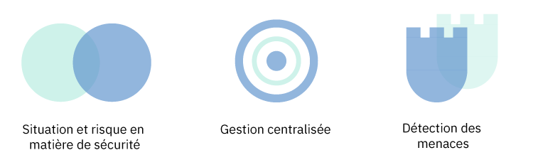
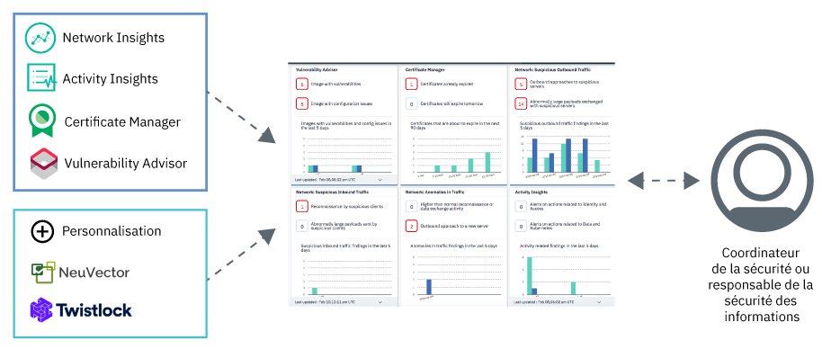

---

copyright:
  years: 2017, 2019
lastupdated: "2019-03-07"

keywords: centralized security, security management, alerts, security risk, insights, threat detection

subcollection: security-advisor

---

{:new_window: target="_blank"}
{:shortdesc: .shortdesc}
{:screen: .screen}
{:pre: .pre}
{:table: .aria-labeledby="caption"}
{:codeblock: .codeblock}
{:tip: .tip}
{:note: .note}
{:important: .important}
{:deprecated: .deprecated}
{:download: .download}

# A propos de {{site.data.keyword.security-advisor_short}}
{: #about}

{{site.data.keyword.security-advisor_long}} permet une gestion de la sécurité centralisée via un tableau de bord unifié qui signale les anomalies aux administrateur de la sécurité et les aide à comprendre, prioriser, gérer et résoudre les problèmes de sécurité liés à leurs charges de travail et applications en cloud.
{: shortdesc}

## Avantages de l'utilisation du service
{: #about-benefits}

<dl>
  <dt>Situation et risque en matière de sécurité</dt>
    <dd>La sécurité des applications demeure une préoccupation importante ; en effet, des articles de presse annonçant des atteintes à la protection des données ou un nouveau piratage sont constamment publiés. Les risques en matière de sécurité feront toujours partie des préoccupations de développement. Sachant combien il est difficile de prévoir les attaques, l'une des meilleures protections consiste à surveiller étroitement vos déploiements en cloud. Par exemple, les risques peuvent être liés à des vulnérabilités au niveau des images de conteneur que vous utilisez, à des certificats arrivés à expiration qui provoquent une indisponibilité de votre application ou service cloud, ou à des clients ou serveurs suspects dont la mauvaise réputation est connue et qui interagissent avec vos clusters.</dd>
  <dt>Gestion de sécurité centralisée</dt>
    <dd>Vous pouvez afficher une vue d'ensemble de tous vos services de sécurité {{site.data.keyword.cloud_notm}} et des services partenaires intégrés. Vous pouvez sélectionner et vous abonner à différents services à partir du catalogue {{site.data.keyword.cloud_notm}}. </dd>
  <dt>Détection des menaces</dt>
    <dd>{{site.data.keyword.security-advisor_short}} s'appuie sur les informations recueillies par IBM X-Force, d'autres services {{site.data.keyword.cloud_notm}} et des solutions partenaires pour détecter les risques et menaces avant qu'ils ne constituent un problème de sécurité. Le service fournit également des analyses des données de vulnérabilité et des données d'activité du réseau.</dd>
</dl>

## Fonctionnement
{: #how-it-works}

Pour garantir la sécurité à grande échelle, {{site.data.keyword.security-advisor_short}} a été conçu comme un micro-service sur {{site.data.keyword.cloud_notm}}. Le micro-service de base mis à disposition est l'API Findings qui implémente pour les services partenaires et {{site.data.keyword.cloud_notm}} le mécanisme d'envoi des résultats de sécurité dans le tableau de bord du service.
{: shortdesc}

Le service reçoit des résultats provenant :
* De services {{site.data.keyword.cloud_notm}} préintégrés tels que Certificate Manager et Vulnerability Advisor
* De Network Insights
* D'Activity Insights
* De partenaires tels que NeuVector et Twistlock
* D'intégrations personnalisées avec vos autres outils de sécurité

Reportez-vous à l'image ci-dessous pour voir comment s'assemblent les composants {{site.data.keyword.security-advisor_short}}. 

{{site.data.keyword.security-advisor_short}} est surtout utile aux administrateurs de la sécurité. Ce rôle peut prendre divers noms. Le tableau suivant présente quelques exemples d'utilisateur :

<table>
  <tr>
    <th colspan=2> Administrateurs de la sécurité</th>
  </tr>
  <tr>
    <td>Responsable des technologies de l'information</td>
    <td>Un responsable des technologies de l'information ou une équipe en charge de l'architecture de l'entreprise définit des règles de conformité et de sécurité à un niveau général pour l'ensemble de la société.</td>
  </tr>
  <tr>
    <td>Responsable de la sécurité des informations</td>
    <td>Un responsable de la sécurité des informations décide comment implémenter les règles définies par le responsable des technologies de l'information pour les systèmes qui sont sous son contrôle. Cela peut inclure le middleware, les serveurs ou l'architecture déployés. Cette personne définit la gouvernance et les règles de sécurité pour l'organisation. Elle surveille les risques de sécurité et définit des contrôles conformes aux normes de conformité, telles que ISO ou GDPR. Elle décide également des outils que les équipes utiliseront.</td>
  </tr>
  <tr>
    <td>Coordinateur de la sécurité</td>
    <td>Cette personne aide le responsable de la sécurité des informations, exécute les contrôles de sécurité requis et identifie les risques ou problèmes de sécurité potentiels. </td>
  </tr>
</table>

Les rôles décrits peuvent être assurés par une même personne ou par plusieurs selon la taille de votre société. Toutefois, l'offre a été créée afin de répondre aux besoins quotidiens d'un responsable de la sécurité des informations ou d'un coordinateur de la sécurité.

### L'API Findings
{: #api}

Clé en main, le service est livré avec des résultats préintégrés marqués par l'API.
{: shortdesc}

L'API Findings de {{site.data.keyword.security-advisor_short}} suit la spécification d'API de métadonnées d'artefact <a href="http://grafeas.ng.bluemix.net/ui/" target="_blank">Grafeas </a> pour stocker, interroger et extraire les métadonnées critiques. Les résultats sont fournis par les services et outils de sécurité.

{{site.data.keyword.security-advisor_short}} est activé par défaut pour tous les comptes {{site.data.keyword.cloud_notm}}. De ce fait, il n'est pas nécessaire de mettre une instance du service à disposition. Une instance de {{site.data.keyword.security-advisor_short}} est créée automatiquement lors de l'accès initial du tableau de bord ou lorsqu'un résultat initial est rapporté. Le service autorise 18 000 résultats, approximativement 200 par jour, pour chaque compte, sur une période de 90 jours. A l'issue des 90 jours, les résultats sont purgés. Les limites de résultats sont surveillées et lorsque le compte atteint la limite avant la fin des 90 jours, le nombre total de résultats est réduit de 50% selon la règle "Premier Entré, Premier Sorti". Lorsque le service reçoit une notification de suppression de compte, tous les résultats afférents à ce compte sont purgés. Vous pouvez extraire tous les résultats de votre compte à l'aide de l'API et les stocker pour une utilisation future ou à des fins d'audit.

## Concepts clés
{: #concepts}

Découvrez les différents concepts que vous pouvez utiliser lors de l'utilisation de {{site.data.keyword.security-advisor_short}}.
{: shortdesc}

<dl>
  <dt>Résultat</dt>
    <dd>Un résultat est un problème de sécurité avec priorité qui est créé lorsque des événements bruts sont traités. Les résultats sont constitués d'informations essentielles nécessaires pour identifier les détails (qui, quoi, quand et où) du problème. En tant qu'administrateur de la sécurité, vous pouvez utiliser les résultats de {{site.data.keyword.security-advisor_short}} pour définir les priorités et réagir aux situations détectées.  Les résultats sont peu nombreux et de taille réduite, mais sont le reflet d'une analyse importante qui nécessite une attention immédiate. Par exemple, votre serveur est infecté par un logiciel malveillant ou un certificat est sur le point d'expirer.</dd>
  <dt>Indicateur clé de risques</dt>
    <dd>L'indicateur clé de risques est une mesure utilisée pour indiquer au coordinateur de la sécurité le risque associé aux résultats. Les indicateurs clé de risques fournissent au coordinateur de la sécurité un signal précoce de l'augmentation de l'exposition aux risques dans diverses zones des ressources de cloud de l'entreprise. Un indicateur clé de risques est déclenché lorsque la valeur d'un résultat dépasse les limites de la plage de performances acceptables pour des contrôles de sécurité spécifiques sur des services et des charges de travail.</dd>
  <dt>Note</dt>
    <dd>Un type particulier de résultat est défini en tant que note. Grafeas divise les informations de métadonnées en notes et occurrences. Les notes sont des descriptions générales de types particuliers de métadonnées. Vous pouvez créer différentes notes pour chaque type de résultat soumis par différents fournisseurs.</dd>
  <dt>Occurrence</dt>
    <dd>Une occurrence décrit les détails d'une note qui sont spécifiques au fournisseur. L'occurrence contient les détails de la vulnérabilité, les étapes de résolution, ainsi que d'autres informations générales.</dd>
  <dt>Carte</dt>
    <dd>Les métadonnées utilisées pour visualiser les résultats dans le tableau de bord du service sont définies par le type de note <code>CARTE</code>. {{site.data.keyword.security-advisor_short}} prend en charge trois types d'éléments d'indicateur clé de risques pour une <code>CARTE</code> : <ul><li>Numérique</li><li>Répartition</li><li>Séries temporelles</li></ul></dd>
  <dt>Fournisseur</dt>
    <dd>Un fournisseur est l'outil ou service qui définit le type de résultat (note), puis qui envoie une occurrence du résultat au service.</dd>
  <dt>Nom de ressource de cloud du service</dt>
    <dd>Le nom de ressource de cloud (CRN) du service identifie le service {{site.data.keyword.Bluemix_notm}} impliqué dans le résultat. Par exemple, dans un résultat d'expiration de certificat, le nom de ressource de cloud ou l'ID de l'instance de service Certificate Manager qui renvoie les résultats est inclus.</dd>
  <dt>Nom de ressource de cloud de la ressource</dt>
    <dd>Le nom de ressource de cloud (CRN) de la ressource identifie la ressource spécifique qui est impliquée dans le résultat. Lorsque Network Analytics renvoie un résultat, le nom de ressource de cloud du cluster Kubernetes est inclus afin d'identifier la ressource ou le cluster affecté.</dd>
</dl>

## Haute disponibilité et reprise après incident
{: #ha-dr}

{{site.data.keyword.security-advisor_short}} est un service multirégion à haute disponibilité.
{: shortdesc}

Actuellement, {{site.data.keyword.security-advisor_short}} est pris en charge dans les régions Dallas et Londres. Dans chacune des régions prises en charge, le service s'exécute dans plusieurs <a href="https://www.ibm.com/blogs/bluemix/2018/06/improving-app-availability-multizone-clusters/" target="_blank">zones de disponibilité </a>. Une reprise après incident régionale a été mise en place pour {{site.data.keyword.security-advisor_short}}. Le service gère une base de données de sauvegarde qui peut être restaurée en trois heures. Toutes les données du service, sauf celles des dernières 24 heures, sont conservées. 
