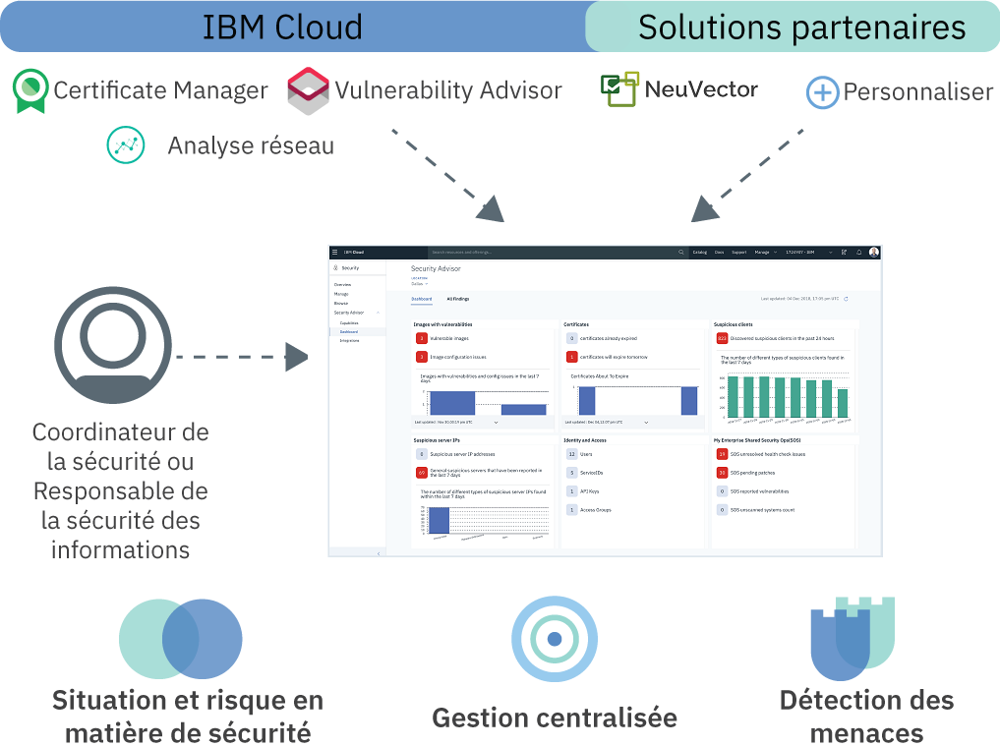

---

copyright:
  years: 2018
lastupdated: "2018-12-09"

---

{:new_window: target="_blank"}
{:shortdesc: .shortdesc}
{:screen: .screen}
{:pre: .pre}
{:table: .aria-labeledby="caption"}
{:codeblock: .codeblock}
{:tip: .tip}
{:download: .download}

# A propos de {{site.data.keyword.security-advisor_short}}
{: #about}

{{site.data.keyword.security-advisor_long}} offre un moyen de gestion de sécurité centralisée via un tableau de bord unifié qui signale les anomalies aux administrateur de la sécurité et les aide à comprendre, établir des priorités, gérer et résoudre les problèmes de sécurité liés à leurs charges de travail et applications en cloud.
{: shortdesc}

## Présentation du service
{: #overview}

Avant de commencer, découvrez l'architecture du service, des cas d'utilisation et les principaux concepts.

**Ce service est-il fait pour moi ?**

Security Advisor est surtout destiné aux administrateurs de la sécurité. Ce rôle recouvre appellations. Le tableau suivant donne quelques exemples d'utilisateurs :

<table>
  <tr>
    <th colspan=2> Administrateurs de la sécurité</th>
  </tr>
  <tr>
    <td>Responsable des technologies de l'information</td>
    <td>Un responsable des technologies de l'information ou une équipe d'architecture de l'entreprise définit des règles de conformité et de sécurité à un niveau élevé pour l'ensemble de la société.</td>
  </tr>
  <tr>
    <td>Responsable de la sécurité des informations</td>
    <td>Un responsable de la sécurité des informations décide comment implémenter les règles définies par le responsable des technologies de l'information pour les systèmes qui sont sous son contrôle. Cela peut inclure le middleware, les serveurs ou l'architecture déployés. Cette personne définit la gouvernance et les règles de sécurité pour l'organisation. Elle surveille les risques de sécurité et définit des contrôles conformes aux normes de conformité, telles que ISO ou GDPR. Elle décide également des outils que les équipes utiliseront.</td>
  </tr>
  <tr>
    <td>Coordinateur de la sécurité</td>
    <td>Cette personne prend en charge le responsable de la sécurité des informations et exécute les contrôles de sécurité requis et identifie les risques ou problèmes de sécurité potentiels. </td>
  </tr>
</table>

Les rôles décrits peuvent être assurés par une même personne ou par plusieurs selon la taille de votre société. Toutefois, l'offre a été créée afin de répondre aux besoins quotidiens d'un responsable de la sécurité des informations ou d'un coordinateur de la sécurité.

 

## Architecture
{: #architecture}

Pour garantir la sécurité à grand échelle, Security Advisor est conçu comme un micro-service sur IBM Cloud. Le micro-service de base fourni est l'API Findings qui implémente pour les services partenaires et IBM Cloud le mécanisme d'envoi des résultats (findings) de sécurité à votre tableau de bord de service.
{: shortdesc}

Le service reçoit des résultats provenant :
* De services IBM Cloud pré-intégrés tels que Certificate Manager et Vulnerability Advisor
* Du module complémentaire d'analyse réseau
* De partenaires tels que NeuVector
* D'intégrations personnalisées avec vos autres outils de sécurité

Observez sur l'image suivante comment s'assemblent les composants Security Advisor.

Architecture 

<dl>
  <dt>Situation et risque en matière de sécurité</dt>
    <dd>La sécurité des applications demeure une préoccupation importante, car des articles de presse annonçant une nouvelle atteinte à la protection des données ou un nouveau piratage sont constamment publiés. Les risques en matière de sécurité seront toujours un élément du développement et, sachant combien il est difficile de prévoir les attaques, l'une des meilleures protections consiste à surveiller étroitement vos déploiements en cloud. Par exemple, les risques peuvent être liés à des vulnérabilités au niveau de vos images de conteneur utilisées, de certificats arrivés à expiration qui provoquent une indisponibilité de votre application ou service cloud, ou de clients ou serveurs suspects dont la mauvaise réputation est connue qui interagissent avec vos clusters.</dd>
  <dt>Gestion de sécurité centralisée</dt>
    <dd>Vous pouvez afficher une vue d'ensemble de tous vos services de sécurité IBM Cloud et des services partenaires intégrés. Vous pouvez sélectionner et vous abonner à différents services à partir du catalogue IBM Cloud.</dd>
  <dt>Détection des menaces</dt>
    <dd>Security Advisor s'appuie sur les informations recueillies par IBM X-Force, d'autres services IBM Cloud et des solutions partenaires pour détecter les risques et menaces avant qu'ils ne deviennent un problème de sécurité. Le service fournit également des analyses des données de vulnérabilité et des données d'activité du réseau.</dd>
</dl>

### L'API Findings
{: #api}

Clé en main, le service est livré avec des résultats (findings) pré-intégrés marqués par l'API.
{: shortdesc}

L'API Findings de Security Advisor suit la spécification d'API de métadonnées d'artefact de type [Grafeas](http://grafeas.ng.bluemix.net/ui/) pour stocker, interroger et extraire les métadonnées critiques. Les résultats sont fournis par les services et outils de sécurité.

Security Advisor est activé par défaut pour tous les comptes IBM Cloud. De ce fait, vous n'avez pas à mettre une instance de service à disposition. Une instance de Security Advisor est automatiquement créée soit à l'accès initial du tableau de bord ou lorsqu'un résultat initial est rapporté. Le service autorise 18 000 résultats, approximativement 200 par jour, pour chaque compte, sur une période de 90 jours. A l'issue des 90 jours, les résultats sont purgés. Les limites de résultats sont surveillées et lorsque le compte atteint la limite avant la fin des 90 jours, le nombre total de résultats est réduit de 50% selon la règle "Premier Entré, Premier Sorti". Lorsque le service reçoit une notification de suppression de compte, tous les résultats afférents à ce compte son purgés. Vous pouvez extraire tous les résultats de votre compte à l'aide de l'API et les stocker pour utilisation future ou à des fins d'audit.

 

## Concepts clés
{: #concepts}

Découvrez les différents concepts que vous pouvez utiliser lors de l'utilisation de {{site.data.keyword.security-advisor_short}}.
{: shortdesc}

<dl>
  <dt>Résultat</dt>
    <dd>Un résultat est un problème de sécurité avec priorité créé quand des événements bruts sont traités. Les résultats sont constitués d'éléments clé d'information nécessaires pour identifier les qui, quoi, quand et où du problème. En tant d'administrateur de la sécurité, vous pouvez utiliser les résultats {{site.data.keyword.security-advisor_short}} pour définir les priorités et réagir aux situations détectées.  Les résultats sont peu nombreux et de taille réduite mais sont le reflet d'une analyse importante qui nécessite une attention immédiate. Par exemple, votre serveur est infecté par un logiciel malveillant ou un certificat est sur le point d'expirer.</dd>
  <dt>Indicateur clé de risques</dt>
    <dd>L'indicateur clé de risques est une mesure utilisée pour indiquer au coordinateur de la sécurité le risque associé aux résultats. Les indicateurs clé de risques fournissent au coordinateur de la sécurité un signal précoce de l'augmentation de l'exposition aux risques dans diverses zones des ressources de cloud de l'entreprise. Un indicateur clé de risques est déclenché quand la valeur d'un résultat dépasse les limites de la plage de performances acceptables pour des contrôles de sécurité spécifiques sur des services et des charges de travail.</dd>
  <dt>Note</dt>
    <dd>Un type particulier de résultat est défini en tant que note. Grafeas divise les informations de métadonnées en notes et occurrences. Les notes sont des descriptions de haut niveau de types particuliers de métadonnées. Vous pouvez créer différentes notes pour chaque type de résultat soumis par différents fournisseurs.</dd>
  <dt>Occurrence</dt>
    <dd>Une occurrence décrit les détails d'une note qui sont spécifique au fournisseur. L'occurrence contient les détails de la vulnérabilité, des étapes de résolution, ainsi que d'autres informations générales.</dd>
  <dt>Carte</dt>
    <dd>Les métadonnées utilisées pour visualiser les résultats dans le tableau de bord de service sont définies par le type de note <code>CARTE</code>. Security Advisor prend en charge trois types d'éléments d'indicateur clé de risques pour une <code>CARTE</code> : <ul><li>Numérique</li><li>Répartition</li><li>Séries temporelles</li></ul></dd>
  <dt>Fournisseur</dt>
    <dd>Un fournisseur est l'outil ou service qui définit le type de résultat (note) puis qui envoie une occurrence du résultat au service.</dd>
  <dt>CRN du service</dt>
    <dd>Le CRN (nom de ressource de cloud) du service identifie le service {{site.data.keyword.Bluemix_notm}} impliqué dans le résultat. Par exemple, dans un résultat d'expiration de certificat, le CNR ou l'ID de l'instance de service Certificate Manager (gestionnaire de certificat) qui renvoie les résultats est inclus.</dd>
  <dt>CRN de la ressource</dt>
    <dd>Le CRN (nom de ressource de cloud) de la ressource identifie la ressource spécifique qui est impliquée dans le résultat. Lorsque l'analyse réseau renvoie un résultat, le CNR du cluster Kubernetes est inclus afin d'identifier la ressource ou le cluster affecté.</dd>
</dl>

 

## Haute disponibilité et reprise après incident
{: #ha-dr}

{{site.data.keyword.security-advisor_short}} est un service à haute disponibilité sur plusieurs régions.
{: shortdesc}

{{site.data.keyword.security-advisor_short}} est actuellement pris en charge dans les régions de Dallas et de Londres. Dans chacune des régions prises en charge, le service s'exécute dans plusieurs [zones de disponibilité](https://www.ibm.com/blogs/bluemix/2018/06/improving-app-availability-multizone-clusters/). {{site.data.keyword.security-advisor_short}} dispose d'une reprise après incident régional. Le service conserve une base de données de sauvegarde qui peut être restaurée en trois heures. Toutes les données du service, sauf celles des dernières 24 heures, sont préservées.

 
 
