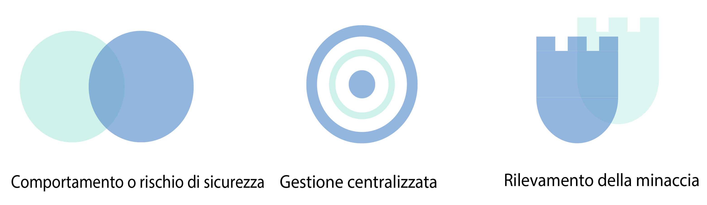
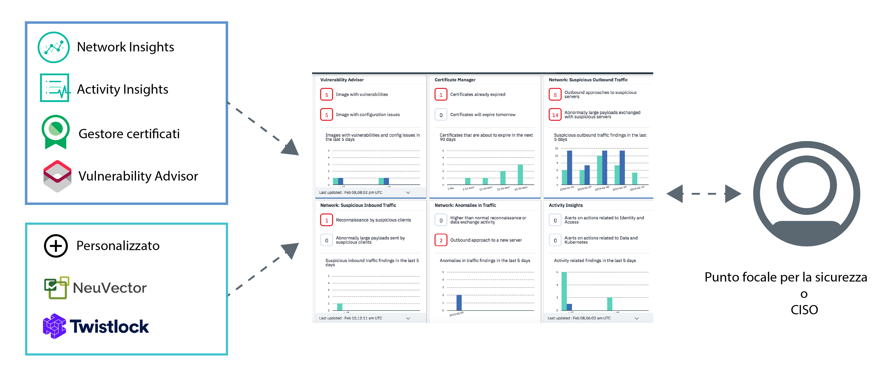

---

copyright:
  years: 2017, 2019
lastupdated: "2019-03-07"

keywords: centralized security, security management, alerts, security risk, insights, threat detection

subcollection: security-advisor

---

{:new_window: target="_blank"}
{:shortdesc: .shortdesc}
{:screen: .screen}
{:pre: .pre}
{:table: .aria-labeledby="caption"}
{:codeblock: .codeblock}
{:tip: .tip}
{:note: .note}
{:important: .important}
{:deprecated: .deprecated}
{:download: .download}

# Informazioni su {{site.data.keyword.security-advisor_short}}
{: #about}

{{site.data.keyword.security-advisor_long}} consente la gestione della sicurezza centralizzata attraverso un dashboard unificato che avvisa dei problemi gli amministratori della sicurezza e li guida a comprendere, assegnare priorità, gestire e risolvere i problemi di sicurezza relativi alle loro applicazioni cloud e ai carichi di lavoro.
{: shortdesc}

## Vantaggi dell'utilizzo del servizio
{: #about-benefits}

<dl>
  <dt>Rischio e postura di sicurezza</dt>
    <dd>La sicurezza delle applicazioni rimane importante con i costanti articoli che annunciano una nuova intrusione o violazione dei dati. I rischi per la sicurezza faranno sempre parte dello sviluppo e anche se gli attacchi possono essere difficili da prevedere, un modo per prevenirli è monitorare da vicino le tue distribuzioni cloud. Ad esempio, i rischi possono essere correlati a vulnerabilità nelle tue immagini contenitore in uso, a certificati in scadenza che possono provocare un'interruzione del tuo servizio o della tua applicazione cloud oppure a client o servizi sospetti con una reputazione negativa che interagiscono con i tuoi cluster.</dd>
  <dt>Gestione della sicurezza centralizzata</dt>
    <dd>Puoi visualizzare una vista consolidata di tutti i tuoi servizi di sicurezza {{site.data.keyword.cloud_notm}} e dei servizi partner integrati. Puoi selezionare e sottoscrivere servizi diversi dal catalogo {{site.data.keyword.cloud_notm}}.</dd>
  <dt>Rilevamento delle minacce</dt>
    <dd>{{site.data.keyword.security-advisor_short}} sfrutta le informazioni raccolte da IBM X-Force, altri servizi {{site.data.keyword.cloud_notm}} e soluzioni partner per rilevare rischi e minacce prima che diventino un problema di sicurezza. Il servizio fornisce anche l'analisi sui dati di vulnerabilità e dati di attività della rete.</dd>
</dl>

## Modalità di funzionamento
{: #how-it-works}

Per rendere il mantenimento della sicurezza su larga scala, {{site.data.keyword.security-advisor_short}} è progettato come un micro-servizio su {{site.data.keyword.cloud_notm}}. Il micro-servizio principale fornito è l'API per le ricerche che implementa il meccanismo con cui i servizi {{site.data.keyword.cloud_notm}} e i servizi partner possono inviare le ricerche sulla sicurezza al tuo dashboard del servizio.
{: shortdesc}

Il servizio riceve le ricerche da:
* Servizi {{site.data.keyword.cloud_notm}} pre-integrati come Gestore certificati e Vulnerability Advisor
* Network Insights
* Activity Insights
* Partner come NeuVector e Twistlock
* Integrazioni personalizzate con altri tuoi strumenti di sicurezza

Controlla la seguente immagine per vedere come si integrano i componenti di {{site.data.keyword.security-advisor_short}}.

{{site.data.keyword.security-advisor_short}} è molto utile per gli amministratori della sicurezza. Tale ruolo può assumere molti nomi. Controlla la seguente tabella per alcuni utenti di esempio:

<table>
  <tr>
    <th colspan=2> Amministratori della sicurezza</th>
  </tr>
  <tr>
    <td>CIO</td>
    <td>Un CIO o un team dell'architettura aziendale definisce le politiche di sicurezza e di conformità di alto livello per l'intera azienda.</td>
  </tr>
  <tr>
    <td>CISO</td>
    <td>Un CISO decide come implementare le politiche impostate dal CIO per i sistemi che sono sotto il loro controllo. Ciò potrebbe includere il middleware, i server o l'architettura che viene distribuita. Questa persona definisce la governance della sicurezza e le politiche di sicurezza per l'organizzazione. Inoltre, monitora i rischi per la sicurezza e definisce i controlli per soddisfare gli standard di conformità come ISO o GDPR. Questa persona decide anche gli strumenti utilizzati dai suoi team.</td>
  </tr>
  <tr>
    <td>Focale di sicurezza</td>
    <td>Questa persona supporta il CISO ed esegue i necessari controlli di sicurezza e indaga su potenziali rischi o problemi. </td>
  </tr>
</table>

I ruoli descritti potrebbero essere eseguiti da una singola persona o da più persone a seconda delle dimensioni della tua azienda. Tuttavia, l'offerta è stata creata per soddisfare le esigenze quotidiane di un CISO o focale di sicurezza.

### API Findings
{: #api}

Come preconfigurazione, il servizio viene fornito con ricerche pre-integrate contrassegnate dall'API.
{: shortdesc}

L'API per le ricerche di {{site.data.keyword.security-advisor_short}} segue la specifica dell'API dei metadati di risorse <a href="http://grafeas.ng.bluemix.net/ui/" target="_blank">Grafeas </a> per archiviare, interrogare e richiamare i metadati critici. Le ricerche vengono segnalate dai servizi e dagli strumenti di sicurezza.

{{site.data.keyword.security-advisor_short}} è abilitato per impostazione predefinita per tutti gli account {{site.data.keyword.cloud_notm}}. Per tale motivo, non hai bisogno di eseguire il provisioning di alcuna istanza del servizio. Un'istanza di {{site.data.keyword.security-advisor_short}} viene creata automaticamente durante l'accesso iniziale del dashboard o quando viene segnalata una ricerca iniziale. Il servizio consente 18.000 ricerche, circa 200 al giorno, per ciascun account, in un periodo di 90 giorni. Alla fine dei 90 giorni, le ricerche vengono eliminate. I limiti di ricerca vengono monitorati e, se l'account raggiunge il limite prima dei 90 giorni, le ricerche totali vengono ridotte al 50% secondo un modello FIFO (First in, First Out). Quando il servizio riceve una notifica di cancellazione dell'account, tutte le ricerche relative a quell'account vengono eliminate. Puoi richiamare tutte le ricerche relative al tuo account utilizzando l'API e archiviarle personalmente per qualsiasi utilizzo futuro o scopo di controllo.

## Concetti chiave
{: #concepts}

Trova ulteriori informazioni sui diversi concetti che puoi utilizzare mentre lavori con {{site.data.keyword.security-advisor_short}}.
{: shortdesc}

<dl>
  <dt>Ricerca</dt>
    <dd>Una ricerca è un problema di sicurezza prioritario creato quando vengono elaborati gli eventi non elaborati. Le ricerche sono composte da pezzi di informazioni chiave necessari per identificare chi e cosa ha causato il problema e quando e dove si è verificato. Come amministratore della sicurezza, puoi utilizzare le ricerche {{site.data.keyword.security-advisor_short}} per assegnare la priorità e reagire alle situazioni rilevate.  Le ricerche sono poche e di piccole dimensioni ma contengono informazioni importanti che richiedono attenzione immediata. Ad esempio, il tuo server è stato infettato da malware o un certificato sta per scadere.</dd>
  <dt>KRI (Key Risk Indicator)</dt>
    <dd>Il KRI (Key Risk Indicator) è una misura utilizzata per indicare il rischio dei risultati della ricerca al focale di sicurezza. I KRI forniscono un primo segnale di aumento dell'esposizione al rischio in varie aree delle risorse cloud aziendali al focale di sicurezza. Un KRI viene attivato quando il valore di una ricerca non rientra nell'intervallo delle prestazioni accettabili per specifici controlli di sicurezza su servizi e carichi di lavoro.</dd>
  <dt>Nota</dt>
    <dd>Un particolare tipo di ricerca è definito come nota. Grafeas divide le informazioni sui metadati in note e ricorrenze. Le note sono descrizioni di livello superiore di particolari tipi di metadati. Puoi creare note diverse per ogni tipo di ricerca inoltrata dai diversi provider.</dd>
  <dt>Ricorrenza</dt>
    <dd>Una ricorrenza descrive i dettagli specifici del provider di una nota. La ricorrenza contiene i dettagli della vulnerabilità, le correzioni e altre informazioni generali.</dd>
  <dt>Scheda</dt>
    <dd>I metadati utilizzati per visualizzare le ricerche nel dashboard del servizio sono definiti in base al tipo di nota - <code>CARD</code>. {{site.data.keyword.security-advisor_short}} supporta tre tipi di elementi KRI per una <code>CARD</code>: <ul><li>Numerico</li><li>Suddivisione</li><li>Serie temporale</li></ul></dd>
  <dt>Provider</dt>
    <dd>Un provider è lo strumento o il servizio che definisce il tipo di ricerca (nota) e invia quindi una ricorrenza della ricerca al servizio.</dd>
  <dt>CRN del servizio</dt>
    <dd>Il CRN del servizio identifica il servizio {{site.data.keyword.Bluemix_notm}} coinvolto nella ricerca. Ad esempio, in una ricerca di scadenza del certificato, verrà incluso l'ID dell'istanza del servizio o il CRN dell'istanza del servizio Gestore certificati che segnala le ricerche.</dd>
  <dt>CRN della risorsa</dt>
    <dd>Il CRN della risorsa identifica la risorsa specifica coinvolta nella ricerca. Quando l'Analisi di rete segnala una ricerca, il CRN del cluster Kubernetes viene incluso per identificare il cluster o la risorsa interessata.</dd>
</dl>

## Alta disponibilità e ripristino di emergenza
{: #ha-dr}

{{site.data.keyword.security-advisor_short}} è un servizio multi-regione altamente disponibile.
{: shortdesc}

{{site.data.keyword.security-advisor_short}} è attualmente supportato nelle regioni di Dallas e Londra. In ciascuna regione supportata, il servizio viene eseguito in diverse <a href="https://www.ibm.com/blogs/bluemix/2018/06/improving-app-availability-multizone-clusters/" target="_blank">zone di disponibilità </a>. {{site.data.keyword.security-advisor_short}} prevede il ripristino di emergenza a livello regionale. Il servizio gestisce un database di backup che può essere rapidamente ripristinato entro tre ore. Vengono forniti tutti i dati del servizio, ad eccezione di quelli delle 24 ore precedenti.
