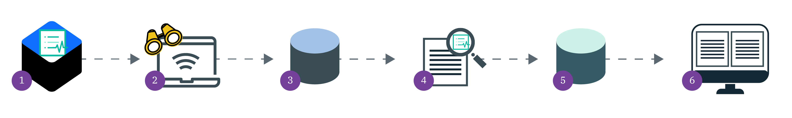

---

copyright:
  years: 2017, 2019
lastupdated: "2019-06-05"

keywords: centralized security, security management, alerts, security risk, insights, threat detection

subcollection: security-advisor

---

{:new_window: target="_blank"}
{:external: target="_blank" .external}
{:shortdesc: .shortdesc}
{:screen: .screen}
{:pre: .pre}
{:table: .aria-labeledby="caption"}
{:codeblock: .codeblock}
{:tip: .tip}
{:note: .note}
{:important: .important}
{:deprecated: .deprecated}
{:download: .download}


# Activity Insights (anteprima)
{: #activity}

Con {{site.data.keyword.security-advisor_long}}, puoi rilevare attività utente sospetta nel tuo account {{site.data.keyword.cloud_notm}} utilizzando il Programma di traccia dell'attività {{site.data.keyword.cloud_notm}}.
{: shortdesc}


## Modalità di funzionamento
{: #activity-how}

La funzione Activity Insights è un componente aggiuntivo del servizio {{site.data.keyword.security-advisor_short}}. Con la funzione abilitata e configurata, il comportamento dell'utente viene registrato e analizzato per identificare dell'attività sospetta in base a delle regole. Puoi utilizzare delle regole predefinite o puoi crearne di personalizzate che si adattano alla tua organizzazione.

Controlla la seguente immagine per vedere il flusso di informazioni.



1. Come amministratore dell'account, puoi installare Activity Insights nei tuoi cluster.
2. Con il componente aggiuntivo installato in un cluster, è possibile monitorare i log del Programma di traccia dell'attività per l'account completo.
3. I log attività vengono inoltrati a un bucket Cloud Object Storage in cui vengono archiviati finché non decidi di eliminarli. Quando utilizzi la GUI {{site.data.keyword.security-advisor_short}} per creare il bucket, vengono assegnati dei ruoli IAM da servizio a servizio in modo che il servizio possa visualizzare i log.
4. Con Activity Insights abilitato, i dati non elaborati nel tuo bucket COS vengono analizzati in base alle regole predefinite dal servizio o che tu puoi personalizzare.
5. Quando viene segnalato un possibile problema di sicurezza, la ricerca viene inoltrata al database delle ricerche.
6. Le ricerche vengono visualizzate nel tuo dashboard del servizio sulla scheda **Activity Insights**.

</br>

## Raccolta di dati
{: #activity-data}

Il Programma di traccia dell'attività raccoglie gli eventi che descrivono le interazioni dell'utente con le API {{site.data.keyword.cloud_notm}}. Puoi in seguito archiviare i log in un bucket Object Storage per ulteriori analisi.
{: shortdesc}

Il Programma di traccia dell'attività raccoglie gli eventi che descrivono le interazioni dell'utente con le API {{site.data.keyword.cloud_notm}}.

Le informazioni raccolte includono:

* L'indirizzo IP dell'iniziatore della chiamata API
* L'utente che è stato autenticato
* Il tipo di attività
* Il risultato dell'attività
* E altro ...

I dati non elaborati che vengono raccolti sono archiviati in un bucket Cloud Object Storage dove puoi determinare la durata dell'archiviazione. Gestisci e controlli i dati raccolti, il che significa che sei responsabile della loro archiviazione, protezione ed eliminazione. {{site.data.keyword.security-advisor_short}} conserva le ricerche per 90 giorni. Durante tale periodo, i risultati vengono visualizzati sulla scheda **Activity Insights** nel dashboard del servizio. Pertanto, anche se non visualizzerai più la ricerca nel tuo dashboard dopo 90 giorni, i dati non elaborati potrebbero ancora essere presenti nell'archivio.

Da un punto di vista della sicurezza, è generalmente una buona idea eliminare i tuoi dati raccolti quando i requisiti legali e aziendali consentono di eliminarli. Per ulteriori informazioni, vedi [Eliminazione degli oggetti](/docs/services/cloud-object-storage/info?topic=cloud-object-storage-security#deletion).
{: tip}

## Activity Insights: Accesso
{: #ai-access}

La scheda Activity Insights nel dashboard del servizio riepiloga tutti i segnali di attività dell'account imprevista o allarmante dai tuoi utenti e servizi. L'attività fuori dall'ordinario potrebbe essere un comportamento non corretto da parte di utenti e servizi legittimi oppure un segnale che il tuo account è compromesso. Le ricerche che visualizzi sulla scheda vengono determinate in base ai pacchetti di regole predefiniti forniti da {{site.data.keyword.security-advisor_short}}.

La scheda introduce due KRI (Key Risk Indicator):

* Identità e accesso: le ricerche correlate ai servizi IAM (Identity and Access Management) o {{site.data.keyword.appid_short_notm}}.
* Dati e Kubernetes: le ricerche correlate a Key Protect, Kubernetes Service, Cloud Object Storage o Certificate Manager.


## Descrizione dei pacchetti di regole
{: #activity-packages}

Come amministratore dell'account, puoi velocemente avviare il monitoraggio dei tuoi account avvalendoti dei pacchetti di regole.
{: shortdesc}

Il servizio offre dei pacchetti di regole associati a diversi servizi, inclusi:

* {{site.data.keyword.containerlong_notm}}
* {{site.data.keyword.cloud_notm}} Identity and Access Management (IAM)
* {{site.data.keyword.cloudcerts_long_notm}}
* {{site.data.keyword.appid_long_notm}}
* {{site.data.keyword.keymanagementservicelong_notm}}
* {{site.data.keyword.cos_full_notm}} (COS)

Se i pacchetti correnti non soddisfano tutti i tuoi bisogni, puoi sempre aggiornare un pacchetto esistente o crearne uno nuovo per personalizzare le regole per la tua organizzazione.

### Cos'è una regola?
{: #ai-rule}

Una regola è una combinazione di condizioni e un singolo evento. Puoi utilizzare le regole o una loro combinazione per attivare le ricerche che puoi visualizzare nel tuo dashboard {{site.data.keyword.security-advisor_short}}.

Esempio:

```
{
	"comment": "Dormant Rule: Very high risk {{site.data.keyword.appid_short_notm}}  activity... ",
		"dormant": true,
		"conditions": { 	… },
		"event": { … }
	"type": "aggregate"
}
```
{: screen}

In aggiunta a una condizione e un evento, le regole possono anche contenere i campi che i trovano nella seguente tabella.

<table>
	<tr>
		<th colspan=2> Descrizione dei componenti di una regola</th>
	</tr>
	<tr>
		<td><code>comment</code></td>
		<td>Sempre ignorato.</td>
	</tr>
	<tr>
		<td><code>dormant</code></td>
		<td>Un campo booleano che se true viene ignorato. Se il valore è false o non definito, viene utilizzata la regola.</td>
	</tr>
	<tr>
		<td><code>type</code></td>
		<td>Le opzioni includono: <code>aggregate</code>, <code>coincident</code> e <code>boolean</code>. Se non viene assegnato a type <code>aggregate</code> o <code>coincident</code>, viene valutato come <code>boolean</code>.</td>
	</tr>
</table>

</br>

### Cos'è una condizione?
{: #ai-condition}

Una condizione di base è un blocco di creazione composto da tre componenti. I blocchi vengono associati utilizzando gli operatori `any` e `all` e possono essere nidificati. Un operatore `all` è equivalente a `and` mentre `any` è equivalente a `or`.

Esempio:

```
"conditions": {
	"all": [{
		"any": [{
			"fact": "action",
				"operator": "equal",
				"value": "iam-groups.group.delete"
		},
		{
			"fact": "action",
				"operator": "equal",
				"value": "iam-groups.member.delete"
		}]
	}
}
```
{: screen}

<table>
	<tr>
		<th colspan=2> Descrizione dei componenti di una condizione</th>
	</tr>
	<tr>
		<td><code>fact</code></td>
		<td>L'evento CADF del Programma di traccia dell'attività che sta venendo controllato.</td>
	</tr>
	<tr>
		<td><code>operator</code></td>
		<td>Le opzioni includono: <code>equal</code>, <code>notEqual</code>, <code>lessThan</code>, <code>greaterThan</code>, <code>in</code> e <code>notIn</code></td>
	</tr>
	<tr>
		<td><code>value</code></td>
		<td>Il modo in cui viene definita l'azione. Il valore normalmente corrisponde a una chiamata API che può essere utilizzata per interagire con il servizio.</td>
	</tr>
</table>

</br>

### Cos'è un evento?
{: #ai-event}

Un evento è formato da due campi: `type` e `params.findingType`. Il primo è un identificativo univoco per una regola, mentre `params.findingType` è il nome della ricerca emessa dall'evento. Il nome della ricerca ne consente la visualizzazione sul dashboard {{site.data.keyword.security-advisor_short}}.

Esempio:

```
{
	"conditions": { 	… },
		"event": {
		"type": "IKS high risk API",
			"params": {"findingType": "IKS-high-risk"}
		}
}
```
{: screen}


### Tipo di regola: aggregate
{: #rule-aggregate}

Un tipo di regola aggregate conta il numero di ricorrenze di un'azione in un intervallo di tempo specifico e poi attiva una ricerca se viene superata la soglia definita. La regola viene definita aggiungendo la soglia e la finestra temporale alla condizione booleana. Devono essere soddisfatte diverse condizioni in modo che la regola venga definita.

* Il tipo di regola deve essere `aggregate`.
* La condizione root deve contenere i seguenti fattori:

	```
	{
			"fact": "occurrences",
			"operator": [equal | greaterThan | greaterThanInclusive],
			"value": [positive number]
	},
	{
	    "fact": "withInLast",
	    "operator": "equal",
	    "value": "X [minutes|hours]",
	}
	```
	{: screen}

	Alcune precisazioni:
	* X = a un numero intero positivo diverso da zero
	* Quando viene selezionato hours, il valore massimo può essere 24
	* Quando viene selezionato minutes, il valore massimo può essere 1440.

#### Esempio
{: #aggregate-example}

Il seguente esempio illustra una regola che conta cinque tentativi non riusciti in un intervallo di 30 minuti:

```
{
    "conditions": {
        "all": [
            {
                "fact": "action",
                "operator": "equal",
                "value": "iam-identity.user-apikey.login"
            },
            {
                "fact": "reason",
                "operator": "equal",
                "value": 400,
                "path": ".reasonCode"
            },
            {
                "fact": "occurrences",
                "operator": "equal",
                "value": 5
            },
            {
                "fact": "withInLast",
                "operator": "equal",
                "value": "30 minutes",
            }
        ]
    },
    "event": {
        "type": "failed-login-attempts",
        "params": {
            "findingType": "failed-login-attempts",
        }
    },
    "type" : "aggregate"
}
```
{: screen}

### Tipo di regola: coincident
{: #rule-coincident}

Un tipo di regola coincident monitora le azioni per vedere quante volte si verifica la stessa azione in una finestra temporale. La regola viene definita aggiungendo una finestra temporale a un gruppo di blocchi di creazione di condizioni di base. L'ordine in cui si verificano le azioni non ha importanza nella regola coincident, ma esistono diverse condizioni che devono essere soddisfatte in modo che la regola venga definita.

* Il tipo di regola deve essere `coincident`.
* La condizione root deve essere del tipo `all`.
* La condizione root deve contenere i seguenti fattori:

	```
	{
	    "fact": "actions",
	    "operator": "contains",
	    "value": [action value]
	},
	{
	    "fact": "withInLast",
	    "operator": "equal",
	    "value": "X [minutes|hours]",
	}
	```
	{: screen}

	Alcune precisazioni:
	* Il valore `fact` deve essere plurale: `actions` non `action`.
	* X = a un numero intero positivo diverso da zero
	* Quando viene selezionato hours, il valore massimo può essere 24
	* Quando viene selezionato minutes, il valore massimo può essere 1440.


#### Esempio
{: #coincident-example}

Il seguente esempio illustra una regola che controlla una simultaneità di tre azioni specifiche che devono verificarsi in un intervallo di trenta minuti:

```
{
    "conditions": {
        "all": [
            {
                "fact": "actions",
                "operator": "contains",
                "value": "iam-identity.user-apikey.login"
            },
            {
                "fact": "actions",
                "operator": "contains",
                "value": "kms.secrets.list"
            },
            {
                "fact": "actions",
                "operator": "contains",
                "value": "kms.secrets.read"
            },
            {
                "fact": "withInLast",
                "operator": "equal",
                "value": "30 minutes",
            }
        ]
    },
    "event": {
        "type": "key-protect-keys-read",
        "params": {
            "findingType": "key-protect-keys-read",
        }
    },
    "type" : "coincident"
}
```
{: screen}

### Tipo di regola: boolean
{: #rule-boolean}

Una regola boolean è formata da una condizione booleana e da un evento. Le regole boolean vengono frequentemente utilizzate per monitorare l'utilizzo API di rischio elevato, l'utilizzo API che non rientra nella finestra di controllo delle modifiche o l'utilizzo API da parte di un iniziatore che non è nella whitelist.

Se una regola non viene definita come `aggregate` o `coincident`, viene valutata come una regola `boolean`.

#### Esempio
{: #boolean-example}

Il seguente esempio illustra una regola che controlla un'eliminazione di una politica al di fuori della finestra di controllo delle modifiche, effettuata da un utente che non è nella whitelist.

```
{
	"conditions": {
		"all": [{
			"any": [{
				"fact": "action",
				"operator": "equal",
				"value": "iam-groups.group.delete"
			},
			{
				"fact": "action",
				"operator": "equal",
				"value": "iam-groups.member.delete"
			}]
		},
		{
			"any": [{
				"fact": "event_time",
				"operator": "lessThan",
				"value": "0800"
			},
			{
				"fact": "event_time",
				"operator": "greaterThan",
				"value": "1700"
			}
			]
		},
		{
			"fact": "initiator",
			"path": ".name",
			"operator": "notIn",
			"value": ["example@ibm.com", "example2@ibm.com"]
		}
		]
	},
	"event": {
		"type": "account-delete",
		"params": {
			"findingType": "iam-delete-account-threshold"
		}
	}
```
{: screen}

Vuoi saperne di più sulle regole boolean? Consulta [la documentazione di Cache-Control](https://github.com/CacheControl/json-rules-engine/blob/master/docs/rules.md){: external}.
{: tip}

## Passi successivi
{: #activity-next}

Pronto per iniziare? Consulta [Abilitazione di Activity Insights](/docs/services/security-advisor?topic=security-advisor-setup-activity)!
