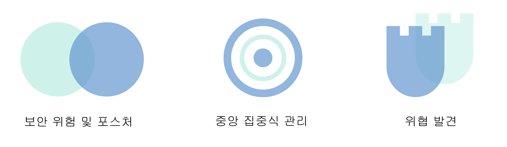
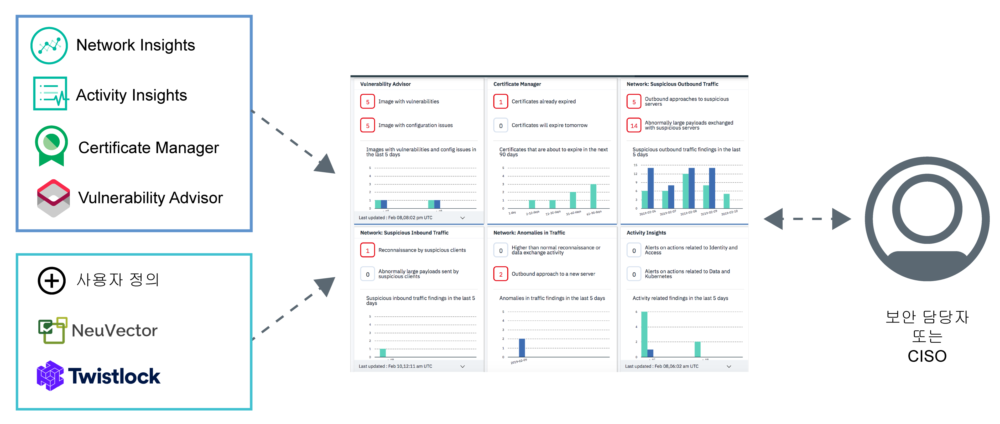

---

copyright:
  years: 2017, 2019
lastupdated: "2019-06-05"

keywords: centralized security, security management, alerts, security risk, insights, threat detection

subcollection: security-advisor

---

{:new_window: target="_blank"}
{:external: target="_blank" .external}
{:shortdesc: .shortdesc}
{:screen: .screen}
{:pre: .pre}
{:table: .aria-labeledby="caption"}
{:codeblock: .codeblock}
{:tip: .tip}
{:note: .note}
{:important: .important}
{:deprecated: .deprecated}
{:download: .download}

# {{site.data.keyword.security-advisor_short}} 정보
{: #about}

{{site.data.keyword.security-advisor_long}}는 보안 관리자에게 문제에 대해 경고하며, 해당 클라우드 애플리케이션 및 워크로드와 관련된 보안 문제를 파악, 우선순위 지정, 관리 및 해결할 수 있도록 안내하는 통합 대시보드를 통해 중앙 집중식 보안 관리를 제공합니다.
{: shortdesc}

## 서비스 사용의 이점
{: #about-benefits}

<dl>
  <dt>보안 위험 및 포스처</dt>
    <dd>새로운 데이터 위반 또는 해킹이 뉴스 기사에 발표되는 상황에서 애플리케이션 보안은 여전히 중요합니다. 보안 위험은 항상 개발의 일부이며 공격을 예측하기는 어렵지만 공격을 차단하는 방법 중 하나는 클라우드 배치를 면밀히 모니터하는 것입니다. 예를 들어 위험은 사용 중인 컨테이너 이미지의 취약성, 클라우드 서비스 또는 애플리케이션의 가동 중단을 유발할 수 있는 인증서의 만기, 클러스터와 상호작용할 때 평판이 나쁜 것으로 알려진 의심스러운 클라이언트 또는 서버와 관련될 수 있습니다.</dd>
  <dt>중앙 집중식 보안 관리</dt>
    <dd>모든 {{site.data.keyword.cloud_notm}} 보안 서비스 및 통합 파트너 서비스에 대한 통합 보기가 표시됩니다. {{site.data.keyword.cloud_notm}} 카탈로그에서 다양한 서비스를 선택하여 등록할 수 있습니다.</dd>
  <dt>위협 발견</dt>
    <dd>{{site.data.keyword.security-advisor_short}}는 IBM X-Force, 기타 {{site.data.keyword.cloud_notm}} 서비스 및 파트너 솔루션에서 수집된 정보를 활용하여 보안 문제로 발전하기 전에 위험 및 위협을 발견합니다. 이 서비스는 취약성 데이터 및 네트워크 활동 데이터 이외에도 분석도 제공합니다. </dd>
</dl>

## 작동 방법
{: #how-it-works}

대규모 보안을 유지보수하기 위해 {{site.data.keyword.security-advisor_short}}는 {{site.data.keyword.cloud_notm}} 기반의 마이크로서비스로 디자인되었습니다. 제공되는 코어 마이크로서비스는 {{site.data.keyword.cloud_notm}} 및 파트너 서비스에서 서비스 대시보드로 보안 찾은 결과를 전송하는 메커니즘을 구현하는 찾은 결과 API입니다.
{: shortdesc}

이 서비스는 다음 항목에서 찾은 결과를 수신합니다.
* Certificate Manager 및 Vulnerability Advisor 등의 사전 통합 {{site.data.keyword.cloud_notm}} 서비스
* Network Insights
* Activity Insights
* NeuVector 및 Twistlock 등의 IBM 비즈니스 파트너
* 다른 보안 도구와의 사용자 정의 통합

{{site.data.keyword.security-advisor_short}} 컴포넌트가 서로 조합되는 방식을 확인하려면 다음 이미지를 참조하십시오.

{{site.data.keyword.security-advisor_short}}는 보안 관리자에게 가장 유용합니다. 이러한 역할에는 다양한 이름이 있습니다. 다음 표에서 몇 가지 사용자 예제를 참조하십시오.

<table>
  <tr>
    <th colspan=2> 보안 관리자</th>
  </tr>
  <tr>
    <td>CIO</td>
    <td>CIO 또는 엔터프라이즈 아키텍처 팀은 회사 전체에 대한 상위 레벨의 보안 및 규제 준수 정책을 정의합니다.</td>
  </tr>
  <tr>
    <td>CISO</td>
    <td>CISO는 CIO가 자신의 통제 하에 있는 시스템에 대해 설정한 정책을 구현하는 방법을 결정합니다. 여기에는 배치된 미들웨어, 서버 또는 아키텍처가 포함될 수 있습니다. 이 사용자는 조직을 위해 보안 통제 및 보안 정책을 정의합니다. 이 사용자는 ISO 또는 GDPR 등의 규제 준수 표준을 충족하도록 보안 위험을 모니터하고 제어를 정의합니다. 또한 이 사용자는 해당 팀에서 사용하는 도구를 결정합니다.</td>
  </tr>
  <tr>
    <td>보안 담당자</td>
    <td>이 사용자는 CISO를 지원하고, 필요한 보안 검사를 실행하고, 잠재적인 위험 또는 문제를 조사합니다. </td>
  </tr>
</table>

여기에서 설명하는 역할은 회사의 규모에 따라 한 명의 사용자 또는 복수의 사용자가 수행할 수 있습니다. 하지만 해당 오퍼링은 CISO 또는 보안 담당자의 일상적인 요구사항을 해결하기 위해 작성되었습니다.

### 찾은 결과 API
{: #api}

이 서비스는 즉시 사용할 수 있도록 API를 통해 플래그 지정된 사전 통합 찾기와 함께 제공됩니다.
{: shortdesc}

{{site.data.keyword.security-advisor_short}} 찾은 결과 API는 중요한 메타데이터를 저장, 조회 및 검색하기 위해 [Grafeas](https://grafeas.io/){: external} 아티팩트 메타데이터 API 스펙을 준수합니다. 찾은 결과는 보안 서비스 및 도구를 통해 보고됩니다.

{{site.data.keyword.security-advisor_short}}는 모든 {{site.data.keyword.cloud_notm}} 계정에서 기본적으로 사용으로 설정되어 있습니다. 따라서 서비스의 인스턴스를 프로비저닝할 필요가 없습니다. {{site.data.keyword.security-advisor_short}}의 인스턴스는 대시보드에 처음으로 액세스할 때 또는 처음으로 찾은 결과가 보고될 때 자동으로 작성됩니다. 이 서비스에서는 90일 기간 동안 각각의 계정에 대해 하루에 약 200개씩, 18,000개의 찾은 결과가 허용됩니다. 90일이 지나면 찾은 결과가 제거됩니다. 찾은 결과 한계를 모니터하는 중에 해당 계정이 90일 이전에 한계에 도달하는 경우 찾은 결과 총계가 선입선출(FIFO) 모델에 따라 50% 로 감소합니다. 이 서비스에서 계정 삭제 알림을 수신하는 경우 해당 계정과 관련된 찾은 결과가 모두 제거됩니다. API를 사용하여 해당 계정에 대한 찾은 결과를 모두 검색한 후 나중에 사용하기 위해 또는 감사 용도로 직접 저장할 수 있습니다.

## 주요 개념
{: #concepts}

{{site.data.keyword.security-advisor_short}} 관련 작업을 수행하는 동안 사용할 수 있는 여러 개념에 대해 자세히 알아보십시오.
{: shortdesc}

<dl>
  <dt>찾은 결과</dt>
    <dd>찾은 결과는 원시 이벤트가 처리될 때 작성되는 우선순위 보안 문제입니다. 찾은 결과는 문제에 대한 사용자, 정보, 시간 및 위치를 식별하는 데 필요한 정보의 주요 부분으로 구성됩니다. 보안 관리자로서 {{site.data.keyword.security-advisor_short}} 찾은 결과를 사용하여 발견된 상황에 대한 우선순위를 지정하고 이 상황에 대응할 수 있습니다.   찾은 결과는 수가 적고 크기가 작지만 즉각적인 주의가 필요한 중요한 인사이트가 포함되어 있습니다. 예를 들어 서버가 악성코드에 감염되거나 인증서가 만료되기 직전인 경우입니다.</dd>
  <dt>주요 위험 지표(KRI)</dt>
    <dd>주요 위험 지표(KRI)는 보안 담당자에게 찾은 결과의 위험성을 표시하기 위해 사용되는 측정치입니다. KRI는 보안 담당자에게 다양한 엔터프라이즈 클라우드 리소스 영역에서 위험 노출이 증가되었음을 알리는 조기 신호를 제공합니다. KRI는 찾은 결과의 값이 서비스 및 워크로드의 특정 보안 제어에 대해 허용 가능한 성능 범위를 벗어날 때 트리거됩니다.</dd>
  <dt>참고</dt>
    <dd>특정 유형의 찾은 결과는 참고로 정의됩니다. Grafeas는 메타데이터 정보를 참고 및 발생으로 분류합니다. 참고는 특정 유형의 메타데이터에 대한 상위 레벨 설명입니다. 다양한 제공자가 제출한 찾은 결과의 각 유형별로 서로 다른 참고를 작성할 수 있습니다.</dd>
  <dt>발생</dt>
    <dd>발생에서는 참고의 제공자별 세부사항에 대해 설명합니다. 발생에는 취약성 세부사항, 조치방안 단계 및 기타 일반 정보가 포함됩니다.</dd>
  <dt>카드</dt>
    <dd>서비스 대시보드에서 찾은 결과를 시각화하기 위해 사용되는 메타데이터는 참고 유형인 <code>CARD</code>로 정의됩니다. {{site.data.keyword.security-advisor_short}}는 카드에 대해 다음과 같은 세 가지 유형의 KRI 요소를 지원합니다. <ul><li>숫자</li><li>분석</li><li>시계열</li></ul></dd>
  <dt>제공자</dt>
    <dd>제공자는 찾은 결과의 유형(참고)을 정의한 후 해당 찾은 결과의 발생을 서비스로 전송하는 도구 또는 서비스입니다.</dd>
  <dt>서비스 CRN</dt>
    <dd>서비스 CRN은 찾은 결과에 포함된 {{site.data.keyword.cloud_notm}} 서비스를 식별합니다. 예를 들어 인증서 만기 찾은 결과의 경우 찾은 결과를 보고하는 Certificate Manager 서비스 인스턴스의 서비스 인스턴스 ID 또는 CRN이 포함됩니다. </dd>
  <dt>리소스 CRN</dt>
    <dd>리소스 CRN은 찾은 결과에 포함된 특정 리소스를 식별합니다. 네트워크 분석에서 찾은 결과를 보고하는 경우 영향을 받는 클러스터 또는 리소스를 식별하기 위해 Kubernetes 클러스터 CRN이 포함됩니다. </dd>
</dl>

## 고가용성 및 재해 복구
{: #ha-dr}

{{site.data.keyword.security-advisor_short}}는 고가용성의 다중 지역 서비스입니다.
{: shortdesc}

{{site.data.keyword.security-advisor_short}}는 현재 댈러스 및 런던 지역에서 모두 지원됩니다. 이 서비스는 지원되는 각각의 지역에 있는 여러 [가용성 구역](https://www.ibm.com/cloud/blog/announcements/improving-app-availability-multizone-clusters){: external}에서 실행됩니다. {{site.data.keyword.security-advisor_short}}는 지역별로 재해 복구를 수행합니다. 이 서비스는 세 시간 내에 신속하게 복원할 수 있는 백업 데이터베이스를 유지보수합니다. 이전 24시간을 제외한 모든 서비스 데이터가 제공됩니다. 
