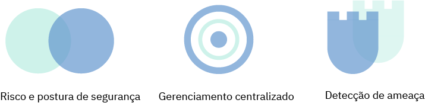
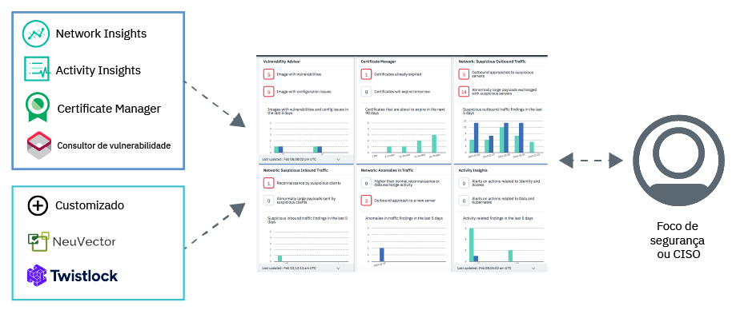

---

copyright:
  years: 2017, 2019
lastupdated: "2019-03-07"

keywords: centralized security, security management, alerts, security risk, insights, threat detection

subcollection: security-advisor

---

{:new_window: target="_blank"}
{:shortdesc: .shortdesc}
{:screen: .screen}
{:pre: .pre}
{:table: .aria-labeledby="caption"}
{:codeblock: .codeblock}
{:tip: .tip}
{:note: .note}
{:important: .important}
{:deprecated: .deprecated}
{:download: .download}

# Sobre {{site.data.keyword.security-advisor_short}}
{: #about}

O {{site.data.keyword.security-advisor_long}} permite o gerenciamento de segurança centralizado por meio de um painel unificado que alerta os administradores de segurança sobre problemas e os orienta para que eles entendam, priorizem, gerenciem e resolvam problemas de segurança relacionados a seus aplicativos em nuvem e cargas de trabalho.
{: shortdesc}

## Benefícios do uso do serviço
{: #about-benefits}

<dl>
  <dt>Risco e postura de segurança</dt>
    <dd>A segurança do aplicativo permanece importante com os constantes artigos de notícias anunciando uma nova violação de dados ou uma invasão. Os riscos de segurança sempre farão parte do desenvolvimento e, embora os ataques possam ser difíceis de prever, uma maneira de evitá-los é monitorar de perto as implementações na nuvem. Por exemplo, os riscos podem estar relacionados a vulnerabilidades nas imagens de contêiner que estão em uso, em certificados que estão expirando, que podem causar indisponibilidade de seu serviço de nuvem ou do aplicativo, ou em clientes ou servidores suspeitos com má reputação conhecida interagindo com seus clusters.</dd>
  <dt>Gerenciamento de segurança centralizada</dt>
    <dd>É possível ver uma visualização consolidada de todos os seus serviços de segurança do {{site.data.keyword.cloud_notm}} e serviços de parceiros integrados. É possível selecionar e assinar serviços diferentes no catálogo do {{site.data.keyword.cloud_notm}}.</dd>
  <dt>Detecção de ameaça</dt>
    <dd>O {{site.data.keyword.security-advisor_short}} aproveita as informações que são reunidas pelo IBM X-Force, outros serviços do {{site.data.keyword.cloud_notm}} e soluções de parceiros para detectar riscos e ameaças antes de se tornarem um problema de segurança. O serviço também fornece análise de dados sobre os dados de vulnerabilidade e os dados de atividade de rede.</dd>
</dl>

## Como ele funciona
{: #how-it-works}

Para manter a segurança em uma escala grande, o {{site.data.keyword.security-advisor_short}} é projetado como um microsserviço no {{site.data.keyword.cloud_notm}}. O microsserviço principal fornecido é a API de descobertas que implementa o mecanismo para o {{site.data.keyword.cloud_notm}} e serviços de parceiros para enviar descobertas de segurança para o painel de serviço.
{: shortdesc}

O serviço recebe descobertas de:
* Serviços {{site.data.keyword.cloud_notm}} pré-integrados como o Certificate Manager e o Vulnerability Advisor
* Network Insights
* Activity Insights
* Parceiros como o NeuVector e o Twistlock
* Integrações customizadas com suas outras ferramentas de segurança

Confira a imagem a seguir para ver a maneira que os componentes do {{site.data.keyword.security-advisor_short}} se encaixam.

{{site.data.keyword.security-advisor_short}}  é mais útil para administradores de segurança. Essa função pode ter muitos nomes. Verifique a tabela a seguir para ver alguns usuários de exemplo:

<table>
  <tr>
    <th colspan=2> Administradores de segurança</th>
  </tr>
  <tr>
    <td>CIO</td>
    <td>Um CIO ou uma equipe de arquitetura empresarial define as políticas de segurança e conformidade em um alto nível para a empresa inteira.</td>
  </tr>
  <tr>
    <td>CISO</td>
    <td>Um CISO decide como implementar as políticas configuradas pelo CIO para os sistemas que estão sob seu controle. Isso poderia incluir middleware, servidores ou a arquitetura que é implementada. Essa pessoa definiria as políticas de segurança e de controle de segurança para a organização. Ela monitoraria o risco de segurança e definiria controles para atender aos padrões de conformidade, como o ISO ou o GDPR. Essa pessoa também decide as ferramentas usadas por suas equipes.</td>
  </tr>
  <tr>
    <td>Focal de segurança</td>
    <td>Essa pessoa apoia o CISO e executa as verificações de segurança necessárias, além de investigar quaisquer riscos ou problemas em potencial. </td>
  </tr>
</table>

As funções descritas podem ser executadas por uma única pessoa ou por várias pessoas, dependendo do tamanho de sua empresa. No entanto, a oferta foi criada para tratar os requisitos do dia a dia de um CISO ou de um Focal de segurança.

### A API de descobertas
{: #api}

O serviço pronto para uso vem com descobertas pré-integradas que são sinalizadas pela API.
{: shortdesc}

A API de descobertas do {{site.data.keyword.security-advisor_short}} segue a especificação de API de metadados de artefato do <a href="http://grafeas.ng.bluemix.net/ui/" target="_blank">Grafeas </a> para armazenar, consultar e recuperar metadados críticos. As descobertas são relatadas pelos serviços e ferramentas de segurança.

O {{site.data.keyword.security-advisor_short}} é ativado por padrão para todas as contas do {{site.data.keyword.cloud_notm}}. Por isso, não é necessário provisionar nenhuma instância do serviço. Uma instância do {{site.data.keyword.security-advisor_short}} é criada automaticamente no acesso inicial do painel ou quando uma descoberta inicial é relatada. O serviço permite 18.000 descobertas, aproximadamente 200 por dia, para cada conta, em um período de 90 dias. No final dos 90 dias, as descobertas são limpas. Os limites de descoberta são monitorados e, se a conta atingir o limite antes de 90 dias, as descobertas totais serão reduzidas para 50% em um modelo PEPS (primeiro a entrar, primeiro a sair). Quando o serviço recebe uma notificação de exclusão de conta, todas as descobertas relacionadas a essa conta são limpas. É possível recuperar todas as descobertas para sua conta usando a API e armazená-las para uso futuro ou para propósitos de auditoria.

## Conceitos-chave
{: #concepts}

Conheça os diferentes conceitos que podem ser usados ao trabalhar com o {{site.data.keyword.security-advisor_short}}.
{: shortdesc}

<dl>
  <dt>Descoberta</dt>
    <dd>Uma descoberta é um problema de segurança prioritário que é criado quando os eventos brutos são processados. As descobertas são compostas das partes principais das informações necessárias para identificar questões relacionadas a quem, o quê, quando e onde do problema. Como um administrador de segurança, é possível usar as descobertas do {{site.data.keyword.security-advisor_short}} para priorizar e reagir às situações detectadas.  As descobertas são poucas e pequenas em tamanho, mas contêm insights importantes que requerem atenção imediata. Por exemplo, seu servidor está infectado com malware ou um certificado está prestes a expirar.</dd>
  <dt>Principal indicador de risco (KRI)</dt>
    <dd>O Principal indicador de risco (KRI) é uma medida usada para indicar o risco das descobertas para o focal de segurança. Os KRIs fornecem um sinal antecipado do aumento de exposições de risco em várias áreas de recursos de nuvem corporativa para o focal de segurança. Um KRI é acionado quando o valor de uma descoberta está fora dos limites do intervalo de desempenho aceitável para controles de segurança específicos em serviços e cargas de trabalho.</dd>
  <dt>Nota</dt>
    <dd>Um tipo específico de descoberta é definido como uma nota. O Grafeas divide as informações de metadados em notas e ocorrências. Notas são descrições de alto nível de tipos específicos de metadados. É possível criar notas diferentes para cada tipo de descoberta enviado por diferentes provedores.</dd>
  <dt>Ocorrência</dt>
    <dd>Uma ocorrência descreve os detalhes específicos de uma nota do provedor. A ocorrência contém os detalhes de vulnerabilidade, as etapas de correção e outras informações gerais.</dd>
  <dt>Card</dt>
    <dd>Os metadados usados para visualizar as descobertas no painel de serviço são definidos pelo tipo de nota: <code>CARD</code>. O {{site.data.keyword.security-advisor_short}} suporta três tipos de elementos KRI para um <code>CARD</code>: <ul><li>Numérico</li><li>Detalhamento</li><li>Série temporal</li></ul></dd>
  <dt>Provedor</dt>
    <dd>Um provedor é a ferramenta ou o serviço que define o tipo de descoberta (nota) e, em seguida, envia uma ocorrência da descoberta para o serviço.</dd>
  <dt>CRN do serviço</dt>
    <dd>O CRN do serviço identifica o serviço do {{site.data.keyword.Bluemix_notm}} que está envolvido na descoberta. Por exemplo, em uma descoberta de expiração de certificado, o ID da instância de serviço ou o CRN da instância de serviço do Certificate Manager que está relatando as descobertas será incluído.</dd>
  <dt>CRN do recurso</dt>
    <dd>O CRN do recurso identifica o recurso específico envolvido na descoberta. Quando o Network Analytics relata uma descoberta, o CRN do cluster do Kubernetes deve ser incluído para identificar o cluster ou o recurso afetado.</dd>
</dl>

## Alta disponibilidade e recuperação de desastre
{: #ha-dr}

O {{site.data.keyword.security-advisor_short}} é um serviço multiregion altamente disponível.
{: shortdesc}

O {{site.data.keyword.security-advisor_short}} é suportado atualmente nas regiões Dallas e Londres. Em cada região suportada, o serviço é executado em várias <a href="https://www.ibm.com/blogs/bluemix/2018/06/improving-app-availability-multizone-clusters/" target="_blank">zonas de disponibilidade  </a>. O {{site.data.keyword.security-advisor_short}} tem a recuperação de desastre regional em vigor. O serviço mantém um banco de dados de backup que pode ser restaurado rapidamente dentro de três horas. Todos os dados de serviço, com exceção das 24 horas anteriores, são fornecidos.
