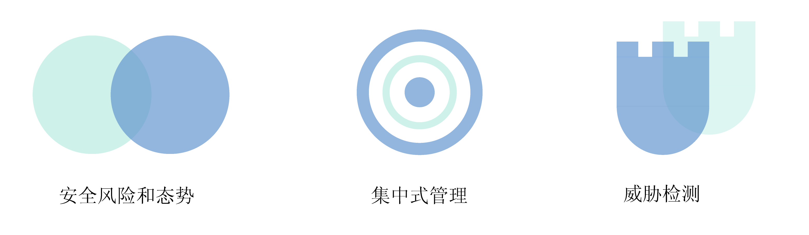
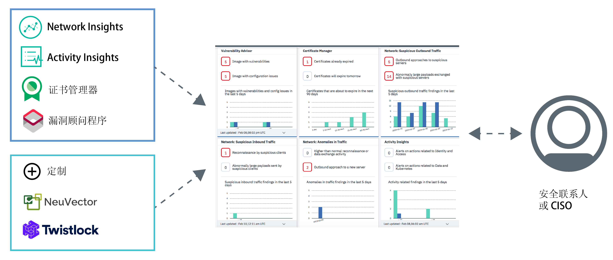

---

copyright:
  years: 2017, 2019
lastupdated: "2019-06-05"

keywords: centralized security, security management, alerts, security risk, insights, threat detection

subcollection: security-advisor

---

{:new_window: target="_blank"}
{:external: target="_blank" .external}
{:shortdesc: .shortdesc}
{:screen: .screen}
{:pre: .pre}
{:table: .aria-labeledby="caption"}
{:codeblock: .codeblock}
{:tip: .tip}
{:note: .note}
{:important: .important}
{:deprecated: .deprecated}
{:download: .download}

# 关于 {{site.data.keyword.security-advisor_short}}
{: #about}

{{site.data.keyword.security-advisor_long}} 通过一个统一的仪表板支持集中安全性管理，包括向安全管理员发出有关问题的警报，以及指导他们了解其云应用程序和工作负载相关的安全问题，对这些问题划分优先级、进行管理并予以解决。
{: shortdesc}

## 使用此服务的优点
{: #about-benefits}

<dl>
  <dt>安全风险和态势</dt>
    <dd>报道新的数据违规或入侵行为的新闻层出不穷，因此应用程序安全性一直非常重要。安全风险将始终是开发工作的一部分，尽管攻击可能难以预测，但可预防攻击的一种方法是密切监视云部署。例如，与风险相关的因素可能包括使用中的容器映像中的漏洞、到期的证书（可能会导致云服务或应用程序中断）或与集群交互的已知声誉不良的可疑客户机或服务器。</dd>
  <dt>集中安全性管理</dt>
    <dd>可以查看所有 {{site.data.keyword.cloud_notm}} 安全服务和集成合作伙伴服务的统一视图。还可以从 {{site.data.keyword.cloud_notm}}“目录”选择和预订不同的服务。</dd>
  <dt>威胁检测</dt>
    <dd>{{site.data.keyword.security-advisor_short}} 利用 IBM X-Force、其他 {{site.data.keyword.cloud_notm}} 服务和合作伙伴解决方案收集的信息来检测风险和威胁，防止它们发展成安全问题。除了漏洞数据和网络活动数据，该服务还提供了分析功能。</dd>
</dl>

## 工作方式
{: #how-it-works}

为了大规模维护安全性，{{site.data.keyword.security-advisor_short}} 设计为 {{site.data.keyword.cloud_notm}} 上的微服务。提供的核心微服务是发现结果 API，用于实现 {{site.data.keyword.cloud_notm}} 和合作伙伴服务将安全发现结果发送到服务仪表板的机制。
{: shortdesc}

服务从以下来源接收发现结果：
* 预集成的 {{site.data.keyword.cloud_notm}} 服务，如 Certificate Manager 和漏洞顾问程序
* Network Insights
* Activity Insights
* NeuVector 和 Twistlock 等 IBM 业务合作伙伴
* 与其他安全工具的定制集成

请查看下图以了解 {{site.data.keyword.security-advisor_short}} 组件的配合工作方式。

{{site.data.keyword.security-advisor_short}} 对于安全性管理员最有用。这一角色可能有许多叫法。请查看下表，了解某些示例用户：

<table>
  <tr>
    <th colspan=2> 安全性管理员</th>
  </tr>
  <tr>
    <td>CIO</td>
    <td>CIO 或企业体系结构团队为整个公司定义高级别的安全性和合规性策略。</td>
  </tr>
  <tr>
    <td>CISO</td>
    <td>CISO 决定如何实施由 CIO 针对所控制的系统设置的策略。系统可能包括部署的中间件、服务器或体系结构。此人将为组织定义安全监管和安全策略，监视安全风险并定义控制措施，以符合 ISO 或 GDPR 等合规标准。此人还将决定其团队使用的工具。</td>
  </tr>
  <tr>
    <td>安全联系人</td>
    <td>此人为 CISO 提供支持，执行所需的安全性检查，并调查任何潜在的风险或问题。</td>
  </tr>
</table>

上述角色可能由一人或多人担任，具体取决于公司的规模。但是，本产品是为了满足 CISO 或安全联系人的日常需求而创建的。

### 发现结果 API
{: #api}

服务随附开箱即用的预集成发现结果，并且发现结果通过 API 进行了标记。
{: shortdesc}

{{site.data.keyword.security-advisor_short}} 发现结果 API 遵循 [Grafeas](https://grafeas.io/){: external} 工件元数据 API 规范来存储、查询和检索关键元数据。发现结果通过安全服务和工具进行报告。

缺省情况下，会为所有 {{site.data.keyword.cloud_notm}} 帐户启用 {{site.data.keyword.security-advisor_short}}。因此，您无需供应任何服务实例。{{site.data.keyword.security-advisor_short}} 的实例将在初始访问仪表板时自动创建，或者在报告初始发现结果时自动创建。服务允许在 90 天时间段内为每个帐户提供 18,000 个发现结果，大约平均每天 200 个。90 天后，系统会清除这些发现结果。系统将监视发现结果限制，如果帐户不到 90 天就达到了限制，那么会按 FIFO（先进先出）模型将发现结果总数减少 50%。服务收到帐户删除通知时，将清除与该帐户相关的所有发现结果。您可以使用 API 来检索自己帐户的所有发现结果，并自行存储这些发现结果，以供未来使用或审计。

## 关键概念
{: #concepts}

了解在使用 {{site.data.keyword.security-advisor_short}} 时可能会用到的不同概念。
{: shortdesc}

<dl>
  <dt>发现结果</dt>
    <dd>发现结果是处理原始事件时创建的优先级安全问题。发现结果由关键信息片段组成，在确定问题所涉及的人员、对象、发生时间和发生位置时需要这些信息。作为安全性管理员，您可以使用 {{site.data.keyword.security-advisor_short}} 发现结果来对检测到的情境划分优先级并做出反应。 发现结果虽然为数不多且大小很小，但包含需要立即关注的重要洞察。例如，服务器被恶意软件感染或证书即将到期。</dd>
  <dt>关键风险指标 (KRI)</dt>
    <dd>关键风险指标 (KRI) 是一种度量，用于向安全联系人指示发现结果的风险。KRI 提供了早期信号，用于提醒安全联系人，企业云资源各个方面的风险敞口在增大。如果发现结果的值超出了服务和工作负载上特定安全性控制可接受的性能范围界限，那么会触发 KRI。</dd>
  <dt>注释</dt>
    <dd>一种特定类型的发现结果被定义为注释。Grafeas 将元数据信息划分为注释和事件实例。注释是对特定类型元数据的高级别描述。可以针对不同提供者提交的每种类型的发现结果创建不同的注释。</dd>
  <dt>事件实例</dt>
    <dd>事件实例描述注释的特定于提供者的详细信息。事件实例包含漏洞详细信息、修复步骤和其他常规信息。</dd>
  <dt>卡</dt>
    <dd>用于在服务仪表板中可视化发现结果的元数据由注释类型 <code>CARD</code> 进行定义。 {{site.data.keyword.security-advisor_short}} 支持三种类型的 KRI 元素用于卡：<ul><li>数字</li><li>细分</li><li>时间序列</li></ul></dd>
  <dt>提供者</dt>
    <dd>提供者是一种工具或服务，用于定义发现结果（注释）类型，然后将发现结果的事件实例发送给服务。</dd>
  <dt>服务 CRN</dt>
    <dd>服务 CRN 标识发现结果中涉及的 {{site.data.keyword.cloud_notm}} 服务。例如，在证书到期发现结果中，将包含报告发现结果的 Certificate Manager 服务实例的服务实例标识或 CRN。</dd>
  <dt>资源 CRN</dt>
    <dd>资源 CRN 标识发现结果中涉及的特定资源。Network Analytics 报告发现结果时，将包含 Kubernetes 集群 CRN 以标识受影响的集群或资源。</dd>
</dl>

## 高可用性和灾难恢复
{: #ha-dr}

{{site.data.keyword.security-advisor_short}} 是一种高可用性多区域服务。
{: shortdesc}

{{site.data.keyword.security-advisor_short}} 目前在达拉斯和伦敦区域均受支持。在每个受支持区域中，该服务可在多个[可用性专区](https://www.ibm.com/cloud/blog/announcements/improving-app-availability-multizone-clusters){: external}中运行。{{site.data.keyword.security-advisor_short}} 已实施区域灾难恢复功能。该服务会维护一个备份数据库，该数据库在三小时内就能快速复原。这将提供所有服务数据，但前 24 小时的数据除外。
