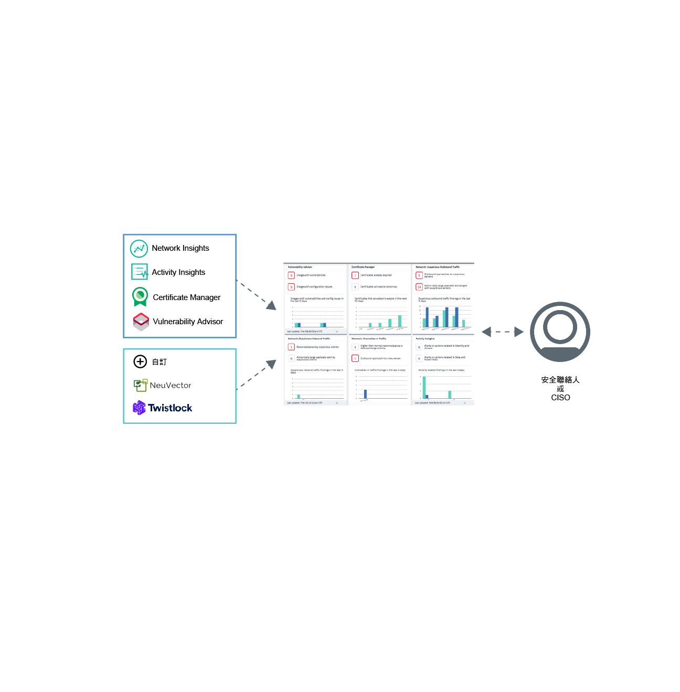

---

copyright:
  years: 2017, 2019
lastupdated: "2019-06-05"

keywords: centralized security, security management, alerts, security risk, insights, threat detection

subcollection: security-advisor

---

{:new_window: target="_blank"}
{:external: target="_blank" .external}
{:shortdesc: .shortdesc}
{:screen: .screen}
{:pre: .pre}
{:table: .aria-labeledby="caption"}
{:codeblock: .codeblock}
{:tip: .tip}
{:note: .note}
{:important: .important}
{:deprecated: .deprecated}
{:download: .download}

# 關於 {{site.data.keyword.security-advisor_short}}
{: #about}

{{site.data.keyword.security-advisor_long}} 透過統一的儀表板來啟用集中式安全管理，以向安全管理者警示問題，並引導他們瞭解、設定優先順序、管理及解決與其雲端應用程式和工作負載相關的安全問題。
{: shortdesc}

## 使用服務的優點
{: #about-benefits}

<dl>
  <dt>安全風險與態勢</dt>
    <dd>報導新的資料外洩或入侵行為的新聞層出不窮，因此應用程式安全一直非常重要。安全風險永遠都會是開發的一環，雖然攻擊可能難以預測，但密切監視雲端部署是其中一種防止的方法。例如，風險可能與下列項目有關：使用中容器映像檔內的漏洞、可能導致雲端服務或應用程式中斷的即將到期憑證，或已知與叢集互動有不良信譽的可疑用戶端或伺服器。</dd>
  <dt>集中式安全管理</dt>
    <dd>您可以查看所有 {{site.data.keyword.cloud_notm}} 安全服務及整合式合作夥伴服務的合併視圖。您可以從 {{site.data.keyword.cloud_notm}} 型錄選取並訂閱不同的服務。</dd>
  <dt>威脅偵測</dt>
    <dd>{{site.data.keyword.security-advisor_short}} 會先利用 IBM X-Force、其他 {{site.data.keyword.cloud_notm}} 服務及合作夥伴解決方案所收集的資訊，在風險和威脅變成安全問題之前，先偵測到它們。除了漏洞資料和網路活動資料，該服務還提供了分析功能。</dd>
</dl>

## 如何運作
{: #how-it-works}

為了維護大規模的安全，{{site.data.keyword.security-advisor_short}} 設計為 {{site.data.keyword.cloud_notm}} 上的微服務。提供的核心微服務是發現項目 API，用於實作 {{site.data.keyword.cloud_notm}} 和合作夥伴服務將安全發現項目傳送到服務儀表板的機制。
{: shortdesc}

服務會從下列項目接收發現項目：
* 預先整合的 {{site.data.keyword.cloud_notm}} 服務，例如 Certificate Manager 及 Vulnerability Advisor
* Network Insights
* Activity Insights
* NeuVector 和 Twistlock 等 IBM 事業夥伴
* 與其他安全工具的自訂整合

請參閱下列影像，以查看 {{site.data.keyword.security-advisor_short}} 元件搭配使用的方式。

{{site.data.keyword.security-advisor_short}} 對安全管理者而言最為有用。該角色可以使用許多名稱。請參閱下表，以取得一些範例使用者：

<table>
  <tr>
    <th colspan=2> 安全管理者</th>
  </tr>
  <tr>
    <td>CIO</td>
    <td>CIO 或企業架構團隊可為整個公司定義高層次的安全和法規遵循原則。</td>
  </tr>
  <tr>
    <td>CISO</td>
    <td>CISO 決定如何實作受控制系統的 CIO 所設定的原則。這可能包括已部署的中介軟體、伺服器或架構。此人員將定義組織的安全控管及安全原則。它們會監視安全風險，並定義控制項以符合法規遵循標準（例如 ISO 或 GDPR）。此人員也會決定其團隊所使用的工具。</td>
  </tr>
  <tr>
    <td>安全聯絡人</td>
    <td>此人員支援 CISO，並執行所需的安全檢查，以及調查任何潛在的風險或問題。</td>
  </tr>
</table>

上述角色可能由一人或多人擔任，具體取決於公司的規模。不過，會建立供應項目來處理 CISO 或「安全聯絡人」的每日需求。

### Findings API
{: #api}

依預設，此服務會隨附 API 所標示的預先整合發現項目。
{: shortdesc}

{{site.data.keyword.security-advisor_short}} 發現項目 API 遵循 [Grafeas](https://grafeas.io/){: external} 構件 meta 資料 API 規格來儲存、查詢和擷取關鍵 meta 資料。這些發現項目是由安全服務及工具所報告。

依預設，所有 {{site.data.keyword.cloud_notm}} 帳戶都會啟用 {{site.data.keyword.security-advisor_short}}。因此，您不需要佈建任何服務實例。起始存取儀表板或報告起始發現項目時，會自動建立 {{site.data.keyword.security-advisor_short}} 的實例。服務容許在 90 天時間段內為每個帳戶提供 18,000 個發現項目，大約平均每天 200 個。90 天結束時，會清除發現項目。發現項目限制受到監視，而且帳戶應該在 90 天前達到限制，但 FIFO（先進先出）模型中的發現項目總數會減少至 50%。服務接收到帳戶刪除通知時，會清除所有與該帳戶相關的發現項目。您可以使用 API 來擷取帳戶的所有發現項目，並自行儲存它們，以供未來使用或審核。

## 主要概念
{: #concepts}

瞭解在使用 {{site.data.keyword.security-advisor_short}} 時可能會用到的不同概念。
{: shortdesc}

<dl>
  <dt>發現項目</dt>
    <dd>發現項目是處理原始事件時所建立的優先順序安全問題。發現項目是由可識別問題的人員、內容、時間及位置所需的重要資訊而組成。身為安全管理者，您可以使用 {{site.data.keyword.security-advisor_short}} 發現項目來設定偵測到狀況的優先順序，並對其做出反應。 發現項目很少且大小很小，但包含需要立即注意的重要洞察。例如，您的伺服器感染惡意軟體，或憑證即將到期。</dd>
  <dt>關鍵風險指標 (KRI)</dt>
    <dd>關鍵風險指標 (KRI) 是一種方法，用來向安全聯絡人指出發現項目的風險。KRI 向安全聯絡人提供早期信號，指出各種企業雲端資源領域中的風險暴露增高了。發現項目的值超出服務及工作負載的特定安全控制的可接受效能範圍時，會觸發 KRI。</dd>
  <dt>附註</dt>
    <dd>特定類型的發現項目定義為附註。Grafeas 將 meta 資料資訊劃分為附註及出現項目。附註是特定 meta 資料類型的高階說明。您可以為不同提供者所提交的每種發現項目類型建立不同的附註。</dd>
  <dt>出現項目</dt>
    <dd>出現項目說明附註的提供者特定詳細資料。出現項目包含漏洞詳細資料、補救步驟及其他一般資訊。</dd>
  <dt>卡片</dt>
    <dd>用來將服務儀表板中的發現項目視覺化的 meta 資料，是由附註類型 <code>CARD</code> 所定義。{{site.data.keyword.security-advisor_short}} 支援三種類型的 KRI 元素用於卡片：<ul><li>數值</li><li>分解</li><li>時間序列</li></ul></dd>
  <dt>提供者</dt>
    <dd>提供者是一種工具或服務，可定義發現項目類型（附註），並將出現的發現項目傳送至服務。</dd>
  <dt>服務 CRN</dt>
    <dd>「服務 CRN」識別發現項目中涉及的 {{site.data.keyword.cloud_notm}} 服務。例如，在憑證到期發現項目中，將會包含報告發現項目的 Certificate Manager 服務實例的服務實例 ID 或 CRN。</dd>
  <dt>資源 CRN</dt>
    <dd>資源 CRN 識別發現項目中涉及的特定資源。Network Analytics 報告發現項目時，將包含 Kubernetes 叢集 CRN 以識別受影響的叢集或資源。</dd>
</dl>

## 高可用性及災難回復
{: #ha-dr}

{{site.data.keyword.security-advisor_short}} 是高度可用的多地區服務。
{: shortdesc}

達拉斯及倫敦地區目前支援 {{site.data.keyword.security-advisor_short}}。在每個受支援地區中，該服務可在多個[可用性區域](https://www.ibm.com/cloud/blog/announcements/improving-app-availability-multizone-clusters){: external}中執行。{{site.data.keyword.security-advisor_short}} 已有地區災難回復。服務會維護可在三個小時內快速還原的備份資料庫。這將提供所有服務資料，但前 24 小時的資料除外。
